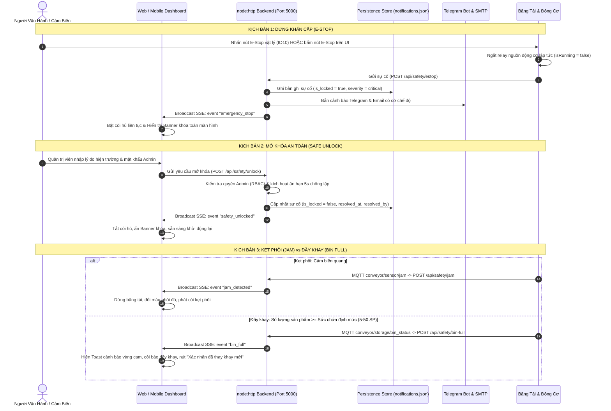
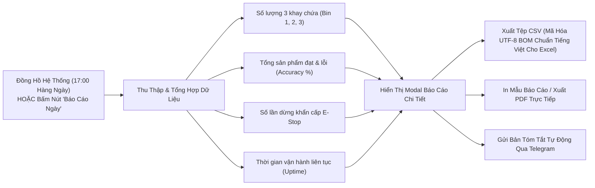
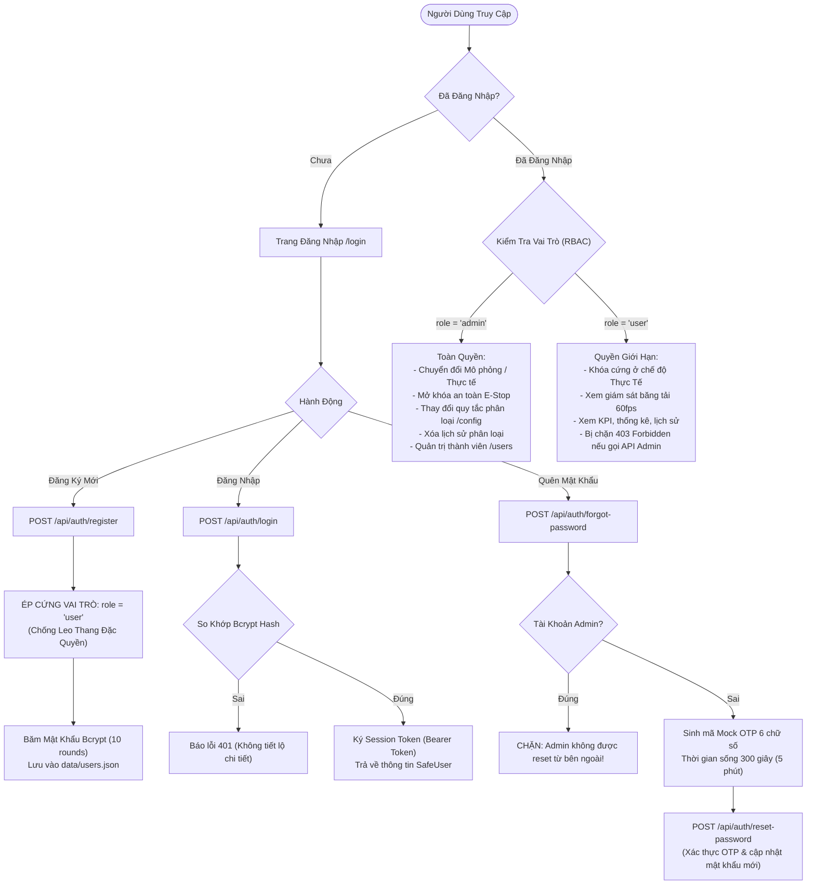
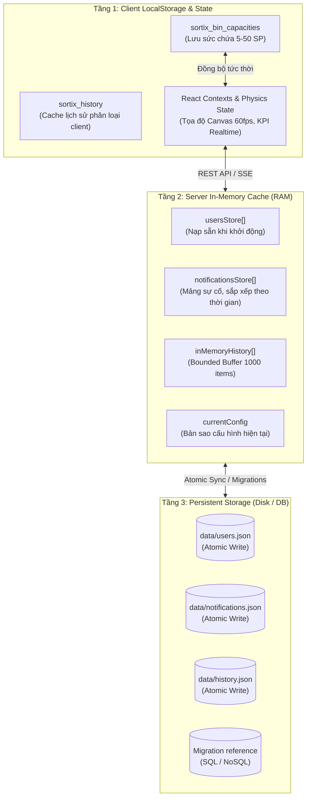

# SortiX-Med — Hệ Thống Tự Động Phân Loại Dụng Cụ Y Tế & Chuẩn Bị Khử Trùng Phòng Mổ (Biomedical & Industrial IoT)

> **Đồ án PBL3 / Capstone Project**: Hệ thống điều khiển, giám sát và tự động phân loại dụng cụ y tế sau phẫu thuật (Bơm kim tiêm / Dao mổ, Kẹp phẫu thuật Pean, Kéo phẫu thuật, Lọ thuốc / Ống nghiệm) theo thời gian thực trên băng tải thông minh nhằm chuẩn bị cho quy trình khử trùng Autoclave phòng mổ. Tích hợp vi điều khiển IoT (**ESP32-C5**), camera thị giác máy tính (**YOLOv8 AI**), bảng điều khiển quản trị phân tầng và ứng dụng di động đa nền tảng (Android APK & iOS PWA) từ một cơ sở mã nguồn duy nhất (1-Codebase Hybrid Architecture).

---

## Ghi chú về cấu trúc runtime hiện tại

Phần mô tả chi tiết bên dưới được giữ lại để làm tài liệu nghiệp vụ và vận hành. Các điểm sau là nguồn sự thật cho cấu trúc code hiện tại:

### Monorepo và entrypoint

- Root dùng npm workspaces cho `frontend`, `backend` và `shared`.
- `frontend` là Next.js 14 App Router, chạy cổng `3000`, gồm page routes và các route handlers tại `frontend/src/app/api`.
- `backend` là HTTP server TypeScript dùng module chuẩn `node:http`, chạy cổng `5000`; không dùng Express. `backend/src/server.ts` điều phối route trực tiếp, còn controllers/routes/services/middlewares cung cấp các lớp nghiệp vụ.
- `shared` chứa `types`, `schemas` và `constants` được dùng ở cả hai workspace.
- Persistence runtime hiện có là `data/history.json`, `data/notifications.json`, `data/sync_state.json` và `data/users.json`; `ConfigModel` giữ cấu hình mặc định trong bộ nhớ. Các migration/seed trong `backend/database` được giữ làm tài liệu triển khai, không được script hiện tại tự động chạy.

### Cây thư mục thực tế

```text
SortiX-Dashboard/
├─ frontend/src/app/              # /, /alerts, /analytics, /config, /conveyor,
│  ├─ devices, /history, /login, /users
│  └─ api/                        # auth, config, history, events, safety, stats,
│                                  # sync, alerts, chat/telegram, users
├─ frontend/src/components/       # layout, overview, conveyor, ui, users, widgets
├─ frontend/src/hooks/            # useSorterData và các hook dữ liệu
├─ frontend/capacitor.config.ts   # webDir: out, server.url từ CAPACITOR_SERVER_URL
├─ backend/src/                   # server, controllers, routes, middleware,
│                                  # models, services, config, utils
├─ backend/database/              # migrations và seeds tham chiếu
├─ shared/{types,schemas,constants}/
├─ data/                          # JSON runtime store
├─ scripts/                       # dev-all, dev, e2e, free-port, test, upgrade workflow
├─ tests/                         # test được nối vào script root và test bổ sung
└─ docs/                          # architecture, api, REFACTOR_PLAN
```

### Lệnh chính hiện có

```powershell
npm run dev              # Frontend Next.js tại :3000
npm run dev:backend      # build rồi start backend tại PORT (mặc định :5000)
npm run dev:all          # điều phối frontend và backend
npm run build            # build frontend
npm run lint             # next lint
npm run build --workspace=backend
npx tsc --noEmit --pretty false
npm test                 # 16 file test được nối trong package.json
npm run test:e2e         # contract desktop/mobile/Capacitor
npm run cap:sync
npm run cap:open
```

`npm test` hiện nối 16 file: `history`, `api_schemas`, `users`, `estop_safety`, `jam_detection`, `simulation_mode_guard`, `jam_simulation_audio`, `bin_full`, `temperature_warning`, `device_offline`, `shift_summary`, `bin_sliders_sync`, `mqtt_disconnected`, `temperature_gauge_simulation_vs_real`, `daily_report_sync` và `cross_device_sync`. Các file `daily_production_cumulative`, `four_user_requests_upgrade`, `mute_siren_feature` và `new_day_report_tele_email` tồn tại nhưng chưa nằm trong script root.

Các mục lịch sử bên dưới có thể mô tả trạng thái ở thời điểm phát hành cũ. Khi có khác biệt, phần ghi chú runtime này và source code hiện tại được ưu tiên.

## 📌 Mục Lục
1. [Giới Thiệu Tổng Quan](#1-giới-thiệu-tổng-quan)
2. [Kiến Trúc Hệ Thống (Monorepo & 1-Codebase Architecture)](#2-kiến-trúc-hệ-thống-monorepo--1-codebase-architecture)
3. [Luồng Hoạt Động & Quy Trình Vận Hành (System Workflows)](#3-luồng-hoạt-động--quy-trình-vận-hành-system-workflows)
   - 3.1. [Sơ Đồ Luồng Hoạt Động Tổng Thể (End-to-End Workflow)](#31-sơ-đồ-luồng-hoạt-động-tổng-thể-end-to-end-workflow)
   - 3.2. [Luồng Phân Loại Dụng Cụ Y Tế Máy Thật (Live Hardware Sorting Flow)](#32-luồng-phân-loại-sản-phẩm-máy-thật-live-hardware-sorting-flow)
   - 3.3. [Luồng Phân Loại Ở Chế Độ Mô Phỏng (Simulation Physics Flow)](#33-luồng-phân-loại-ở-chế-độ-mô-phỏng-simulation-physics-flow)
   - 3.4. [Luồng An Toàn Công Nghiệp & Xử Lý Sự Cố (Safety & Incident Flow)](#34-luồng-an-toàn-công-nghiệp--xử-lý-sự-cố-safety--incident-flow)
   - 3.5. [Luồng Báo Cáo 1 Ngày Làm Việc (Shift Summary Workflow)](#35-luồng-báo-cáo-1-ngày-làm-việc-shift-summary-workflow)
   - 3.6. [Luồng Cấu Hình Quy Tắc Phân Loại (Configuration Sync Flow)](#36-luồng-cấu-hình-quy-tắc-phân-loại-configuration-sync-flow)
   - 3.7. [Luồng Xác Thực Người Dùng & Phân Quyền RBAC (Auth & Access Control)](#37-luồng-xác-thực-người-dùng--phân-quyền-rbac-auth--access-control)
4. [Cơ Chế Hoạt Động Của Cơ Sở Dữ Liệu (Database Architecture)](#4-cơ-chế-hoạt-động-của-cơ-sở-dữ-liệu-database-architecture)
   - 4.1. [Chiến Lược Lưu Trữ 2 Tầng (Dual-Mode Persistence Strategy)](#41-chiến-lược-lưu-trữ-2-tầng-dual-mode-persistence-strategy)
   - 4.2. [Cơ Chế Ghi File Nguyên Tử (Atomic File Write Mechanism)](#42-cơ-chế-ghi-file-nguyên-tử-atomic-file-write-mechanism)
   - 4.3. [Chi Tiết Các Bảng & Thực Thể Dữ Liệu (Entities & Schemas)](#43-chi-tiết-các-bảng--thực-thể-dữ-liệu-entities--schemas)
   - 4.4. [Cơ Chế Đồng Bộ Dữ Liệu 3 Lớp (3-Tier Data Synchronization)](#44-cơ-chế-đồng-bộ-dữ-liệu-3-lớp-3-tier-data-synchronization)
   - 4.5. [Bộ Migrations Đa CSDL Sẵn Sàng Triển Khai (Multi-DB Migrations)](#45-bộ-migrations-đa-csdl-sẵn-sàng-triển-khai-multi-db-migrations)
5. [Công Nghệ Sử Dụng](#5-công-nghệ-sử-dụng)
6. [Tài Khoản Mặc Định & Phân Quyền (RBAC)](#6-tài-khoản-mặc-định--phân-quyền-rbac)
7. [Cài Đặt & Khởi Chạy Nhanh](#7-cài-đặt--khởi-chạy-nhanh)
8. [Đóng Gói Ứng Dụng Di Động (Mobile App: Android APK & iOS PWA)](#8-đóng-gói-ứng-dụng-di-động-mobile-app-android-apk--ios-pwa)
9. [Chế Độ Vận Hành: Mô Phỏng vs. Máy Thật](#9-chế-độ-vận-hành-mô-phỏng-vs-máy-thật)
10. [Các Trang Chức Năng Chính](#10-các-trang-chức-năng-chính)
11. [Hệ Thống An Toàn, Giám Sát & Cảnh Báo](#11-hệ-thống-an-toàn-giám-sát--cảnh-báo)
12. [Hệ Thống Xác Thực & Bảo Mật](#12-hệ-thống-xác-thực--bảo-mật)
13. [Kiểm Thử & Đảm Bảo Chất Lượng (QA)](#13-kiểm-thử--đảm-bảo-chất-lượng-qa)
14. [Biến Môi Trường (Environment Variables)](#14-biến-môi-trường-environment-variables)
15. [Xử Lý Sự Cố Thường Gặp (Troubleshooting)](#15-xử-lý-sự-cố-thường-gặp-troubleshooting)
16. [Nhóm Tác Giả & Đóng Góp](#16-nhóm-tác-giả--đóng-góp)

---

## 1. Giới Thiệu Tổng Quan

**SortiX-Med** là hệ thống IoT Y tế chuyên dụng phục vụ công tác thu gom, tự động nhận diện và phân loại dụng cụ phẫu thuật phòng mổ. Hệ thống giải quyết bài toán chống lây nhiễm chéo các tác nhân nguy hiểm (HIV, HBV, HCV...) và phòng chống tai nạn nghề nghiệp do vật sắc nhọn đâm phải cho đội ngũ y bác sĩ và kỹ thuật viên y tế.

### 🌟 Tính năng nổi bật:
- 🚀 **Trực quan hóa vật lý 60fps (HTML5 Canvas & 2D Digital Twin)**: Mô phỏng chi tiết 4 nhóm dụng cụ y tế (Bơm tiêm/Dao mổ, Kẹp phẫu thuật Pean, Kéo mổ, Ống nghiệm) di chuyển trên băng tải, qua cảm biến quang và phân luồng chính xác vào 3 khay chứa y tế chuyên dụng.
- 📱 **Hỗ Trợ Di Động Đa Nền Tảng (1-Codebase Hybrid Mobile App)**:
  - **Android**: Đóng gói thành file `.apk` cài đặt trực tiếp thông qua **Capacitor 8**, tích hợp splash screen, cấu hình `usesCleartextTraffic` và webview hiệu năng cao.
  - **iOS (iPhone/iPad)**: Chế độ PWA Standalone toàn màn hình (qua Safari "Thêm vào MH chính"), tối ưu viewport chuẩn `viewportFit: "cover"`, chống zoom ngoài ý muốn (`maximumScale: 1, userScalable: false`).
  - **Tối ưu trải nghiệm cảm ứng di động**: Thanh điều hướng dạng ngăn kéo (Drawer Sidebar), nút chuyển đổi chế độ Mô phỏng/Thực tế dạng viên nang (Pill Button) ngay trên TopHeader và thanh menu Sidebar.
- 🎚️ **Độ Rộng & Sức Chứa Khay Tùy Chỉnh (Dynamic Bin Capacities 5 - 50 SP)**: Mỗi khay cho phép tùy chỉnh định mức chứa từ 5 đến 50 sản phẩm qua thanh trượt mượt mà; tự động đồng bộ tức thời giữa thanh trượt máng trượt Canvas, Widget giám sát, trang Cấu hình và LocalStorage.
- 🌡️ **Đồng Hồ Đo Nhiệt Độ Bán Nguyệt (Dual-Mode Temperature Gauge)**: 
  - *Chế độ Mô phỏng*: Cung cấp thanh trượt ảo (30°C - 95°C) và các nút đặt nhanh (42.5°C, 72.0°C, 78.5°C) để thử nghiệm phản ứng quá nhiệt.
  - *Chế độ Thực tế*: Tự động ẩn thanh trượt giả lập, hiển thị bảng telemetry phần cứng (cảm biến DS18B20 / ESP32) với nhãn `[PHẦN CỨNG THẬT]` và kim đo nhảy theo telemetry thực.
- 📡 **Giám Sát Kết Nối IoT & Mạng Đa Tầng**:
  - Tự động phát hiện mất kết nối MQTT Broker quá 5 giây (`mqtt_disconnected`), đổi huy hiệu Header sang đỏ chớp nháy, phát còi cảnh báo và tự động kết nối lại theo lịch trình (3s -> 5s -> 10s).
  - Watchdog 6 giây giám sát nhịp tim định kỳ 2 giây (`conveyor/heartbeat`), cảnh báo tức thì khi vi điều khiển ESP32 ngoại tuyến (`device_offline`).
- 📋 **Báo Cáo 1 Ngày Làm Việc (Shift Summary)**:
  - Đồng bộ trực tiếp dữ liệu phân loại thực tế: số lượng 3 khay chứa, số sản phẩm đạt/lỗi, tỷ lệ chính xác, số lần dừng khẩn cấp và thời gian vận hành.
  - Hỗ trợ xem Modal thống kê, xuất báo cáo CSV có UTF-8 BOM hiển thị tiếng Việt chuẩn trên Excel, và mẫu in ấn / xuất PDF chuyên nghiệp.
- 🔊 **Âm thanh công nghiệp thuần (Web Audio API)**: Bộ phát âm thanh tổng hợp tín hiệu âm thanh cảnh báo còi hú, còi khay đầy, còi quá nhiệt, còi mất kết nối, tiếng piston nén khí và nạp phôi mà không phụ thuộc file âm thanh ngoài.
- 👥 **Quản lý người dùng & Phân quyền chặt chẽ (RBAC)**: Đầy đủ các luồng Đăng ký, Đăng nhập, Đổi mật khẩu, Quên mật khẩu OTP, Khóa/Mở tài khoản và chống leo thang đặc quyền.
- 🚨 **Cảnh báo đa kênh & An toàn công nghiệp**:
  - Tự động gửi Email (SMTP) và tin nhắn khẩn cấp qua Telegram Bot kèm nhãn định danh chế độ vận hành (`🧪 Chế độ Giả Lập` / `🔴 Phần cứng Thực Tế`).
  - Hệ thống **Dừng khẩn cấp (E-Stop)**: Dừng băng chuyền lập tức, còi hú liên tục, banner khóa an toàn, chỉ Admin có quyền mở khóa kèm lý do hiện trường và cơ chế chống kẹt loop echo 5s.
  - Phân định rõ ràng **Đầy khay (`bin_full`)** vs **Kẹt phôi (`jam_detected`)**: Đầy khay khi số lượng đạt định mức (ví dụ 30/30 hoặc 50/50 SP); Kẹt phôi khi cảm biến quang học #02 che khuất liên tục > 5 giây.
- 🔒 **Cô lập Chế độ Vận hành**: Toàn bộ nút giả lập thử nghiệm chỉ xuất hiện ở chế độ Mô phỏng, hoàn toàn bị ẩn và chặn ở chế độ Thực tế để bảo vệ dữ liệu phần cứng.

---

## 2. Kiến Trúc Hệ Thống (Monorepo & 1-Codebase Architecture)

Mã nguồn được tổ chức theo chuẩn **Monorepo (npm workspaces)** với mô hình **1-Codebase**: toàn bộ Web máy tính, Cloud Vercel, ứng dụng di động Android APK và iOS PWA đều chia sẻ 100% logic và giao diện:

```
SortiX-Dashboard/
├── backend/                  # Standalone Backend Server (Node.js node:http + TypeScript)
│   ├── database/             # File migrations (SQLite, PostgreSQL, MySQL, MongoDB) & Seeds
│   │   ├── migrations/       # SQL scripts tạo bảng Users & Schema
│   │   └── seeds/            # Khởi tạo 4 tài khoản Quản trị viên ban đầu
│   ├── scripts/              # Build helper scripts (patch-dist-aliases.cjs)
│   ├── src/
│   │   ├── config/           # Cấu hình biến môi trường (env.ts)
│   │   ├── controllers/      # Điều phối nghiệp vụ (user, config, history, stats, alert, safety)
│   │   ├── middlewares/      # Auth JWT/Bearer, Zod validator, Error Handler
│   │   ├── models/           # Quản lý tầng dữ liệu (userModel, historyModel, configModel, notificationModel)
│   │   ├── routes/           # RESTful API endpoints (/api/auth, /api/users, /api/safety, ...)
│   │   ├── services/         # Logic nghiệp vụ (safetyService, sseService, alertNotificationService, mqttService, ...)
│   │   ├── utils/            # Tiện ích chuyển đổi dữ liệu và định dạng thông báo
│   │   └── server.ts         # Điểm khởi động HTTP node:http Server (Port 5000)
│   ├── package.json
│   └── tsconfig.json
├── frontend/                 # Client UI Next.js 14 App Router & Mobile Shell
│   ├── android/              # Native Android Studio Project (Capacitor Bridge)
│   │   ├── app/
│   │   │   ├── build/outputs/apk/debug/app-debug.apk # File APK cài đặt (SortiX-Dashboard.apk)
│   │   │   └── src/main/AndroidManifest.xml          # Cấu hình quyền & Cleartext Traffic
│   │   └── build.gradle
│   ├── capacitor.config.ts   # Cấu hình Capacitor (App ID, App Name, Server URL, Cleartext)
│   ├── out/                  # Offline Shell (index.html dự phòng khi mất mạng)
│   ├── public/               # Tài nguyên tĩnh, biểu tượng app, manifest
│   ├── src/
│   │   ├── app/              # Page routes và API route handlers (/api/auth, /api/safety, /api/events, ...)
│   │   │   ├── layout.tsx    # Cấu hình Viewport chống zoom, theme-color, HTML layout
│   │   │   ├── page.tsx      # Trang Tổng Quan Dashboard
│   │   │   ├── conveyor/     # Trang Giám Sát Băng Tải Canvas 60fps
│   │   │   ├── config/       # Trang Cấu Hình Quy Tắc Phân Loại & Dung Lượng Khay
│   │   │   ├── analytics/    # Trang Phân Tích Số Liệu & Biểu Đồ Recharts
│   │   │   ├── devices/      # Trang Giám Sát Thiết Bị & Telemetry IoT
│   │   │   ├── history/      # Trang Bảng Lịch Sử Phân Loại & Xuất CSV
│   │   │   ├── alerts/       # Trang Quản Lý Cảnh Báo Sự Cố
│   │   │   ├── users/        # Trang Quản Trị Thành Viên & Phân Quyền (Admin Only)
│   │   │   └── login/        # Trang Đăng Nhập, Đăng Ký & Quên Mật Khẩu
│   │   ├── components/       # Components mô-đun hóa
│   │   │   ├── conveyor/     # BinTrays.tsx, ConveyorControls.tsx, QuickFeedBar.tsx
│   │   │   ├── layout/       # DashboardLayout, TopHeader (Mobile Pill), Sidebar (Drawer Switcher), Banners
│   │   │   ├── overview/     # KpiStatGrid, LiveHealthAndBinWidget, CalendarWidget, RecentActivityList
│   │   │   ├── ui/           # TemperatureGaugeWidget, ShiftSummaryModal, Modals & Toasts
│   │   │   ├── ConfigAndDiagnostics.tsx # Chẩn đoán & cấu hình thiết bị
│   │   │   └── ConveyorVisualizer.tsx    # Khối trực quan băng chuyền 60fps
│   │   ├── contexts/         # React Contexts (AuthContext, Theme, DashboardContext)
│   │   ├── hooks/            # useConveyorPhysics, useMQTT, useSorterData
│   │   ├── lib/              # Client utilities, Audio Service, Data Processor, CSV Exporter
│   │   └── services/         # API Clients (apiSafetyClient, apiConfigClient, apiHistoryClient, sseService)
│   ├── package.json
│   └── tsconfig.json
├── shared/                   # Tầng dùng chung giữa Frontend và Backend
│   ├── constants/            # Hằng số toàn hệ thống (Topics MQTT, mã màu khay, role, default configs)
│   ├── schemas/              # Zod validation schemas (.passthrough() linh hoạt cho firmware)
│   ├── types/                # TypeScript interfaces chuẩn mực
│   └── package.json
├── data/                     # Dữ liệu cục bộ bền vững (users.json, notifications.json)
├── docs/                     # Tài liệu kỹ thuật chi tiết
│   ├── architecture.md       # Thiết kế kiến trúc phân tầng, Mobile Shell & An toàn
│   ├── api.md                # Đặc tả API routes, aliases safety và SSE
│   └── REFACTOR_PLAN.md      # Kế hoạch & lộ trình nâng cấp hệ thống
├── scripts/                  # Root orchestration scripts (dev-all.cjs)
├── tests/                    # Contract/integration tests; script root hiện chạy 16 file
├── FINAL_INTEGRATION_REPORT.md # Báo cáo tổng kết tích hợp hệ thống cuối cùng
├── CHANGELOG.md              # Nhật ký thay đổi hệ thống chi tiết qua các phiên bản
├── AGENTS.md                 # Quy chuẩn kỹ thuật, Mobile Rules & Bảo mật bắt buộc
├── .env.example              # Mẫu biến môi trường cho Frontend Next.js
└── package.json              # Root package quản lý Monorepo Workspaces & Scripts di động
```

---

## 3. Luồng Hoạt Động & Quy Trình Vận Hành (System Workflows)

Phần này mô tả chi tiết cách thức toàn bộ hệ thống phối hợp từ phần cứng IoT, thị giác máy tính, MQTT Broker, máy chủ API cho đến giao diện người dùng.

### 3.1. Sơ Đồ Luồng Hoạt Động Tổng Thể (End-to-End Workflow)

```mermaid
flowchart TD
    subgraph HARDWARE_LAYER["1. Tầng Phần Cứng & Thu Thập Dữ Liệu"]
        CAM["Camera AI YOLOv8"] -->|"Nhận diện dụng cụ y tế"| DETECT["Kết quả Detection (loại dụng cụ, confidence)"]
        SENSORS["Cụm Cảm Biến S1-S3 + Encoder + DS18B20"] -->|"Đo tốc độ, nhiệt độ, kẹt dụng cụ"| ESP32["Vi điều khiển ESP32-C5"]
        DETECT -->|"UART Serial / Wi-Fi 6"| ESP32
    end

    subgraph IOT_COMMUNICATION["2. Tầng Truyền Thông IoT (MQTT Broker)"]
        ESP32 -->|"Publish: sorter/01/vision"| BROKER["MQTT Broker (EMQX / Mosquitto)"]
        ESP32 -->|"Publish: sorter/01/telemetry"| BROKER
        ESP32 -->|"Publish: conveyor/heartbeat (chu kỳ 2s)"| BROKER
        ESP32 -->|"Publish: conveyor/sensor/jam"| BROKER
        ESP32 -->|"Publish: conveyor/storage/bin_status"| BROKER
    end

    subgraph SERVER_LAYER["3. Tầng Máy Chủ Backend (node:http Port 5000)"]
        BROKER -->|"Subscribe / Ingest"| BACKEND["node:http API Server"]
        BACKEND -->|"Watchdog 6s"| HEARTBEAT_MONITOR["Heartbeat & Health Monitor"]
        BACKEND -->|"Ghi nhận sự cố"| SAFETY_SVC["Safety & Alert Engine"]
        SAFETY_SVC -->|"Ghi Atomic Write"| DB_STORE[("Persistence Data Store\ndata/users.json\ndata/notifications.json")]
        SAFETY_SVC -->|"Gửi cảnh báo khẩn"| ALERT_CHANNELS["Telegram Bot & SMTP Email"]
        SAFETY_SVC -->|"Broadcast Realtime"| SSE_STREAM["SSE Stream (/api/events)"]
    end

    subgraph CLIENT_LAYER["4. Tầng Giao Diện Khách (Web & Mobile App)"]
        BROKER -.->|"WebSocket WSS (Telemetry cao tần)"| CLIENTS["Next.js Dashboard & Mobile APK / PWA"]
        SSE_STREAM -->|"Nhận sự cố khẩn cấp"| CLIENTS
        CLIENTS -->|"Vẽ Canvas 60fps & Servo"| CANVAS["Canvas 60fps Visualizer"]
        CLIENTS -->|"Phát âm thanh còi / gạt servo"| AUDIO["Web Audio Synthesizer"]
        CLIENTS -->|"REST API Calls (Admin config, unlock)"| BACKEND
    end
```



---

### 3.2. Luồng Phân Loại Dụng Cụ Y Tế Máy Thật (Live Hardware Sorting Flow)

1. **Dụng cụ đi vào băng tải**: Động cơ băng tải quay với vận tốc được giám sát qua cảm biến Encoder (`conveyor_speed`). Dụng cụ y tế sau phẫu thuật lần lượt đi qua Cảm biến S1 (IO0 - Phát hiện vật vào và kích hoạt cụm camera).
2. **Camera AI YOLOv8 nhận diện dụng cụ y tế**:
   - Camera công nghiệp tại trạm nhận diện chụp ảnh khi dụng cụ đi qua vùng ROI của Cảm biến S1.
   - Mô hình Vision AI YOLOv8 phân loại 4 nhóm dụng cụ y tế và xuất độ tin cậy `confidence` (0.00 – 1.00):
     - `med_syringe`: Bơm kim tiêm / Dao mổ (Vàng y tế `#EAB308`)
     - `med_forceps`: Kẹp phẫu thuật Pean (Xanh dương y tế `#0284C7`)
     - `med_scissors`: Kéo phẫu thuật (Xanh tím tiệt trùng `#6366F1`)
     - `med_vial`: Lọ thuốc / Ống nghiệm (Xanh ngọc Emerald `#10B981`)
   - Kết quả được đóng gói vào payload `VisionDetection` và gửi lên MQTT topic `sorter/01/vision`.
3. **Tra cứu quy tắc phân loại & Cơ chế An toàn Fail-safe**:
   - ESP32-C5 so khớp `brand` với bảng quy tắc cấu hình `rules` hiện tại:
     - `med_syringe` -> **Khay 1: Thùng vật sắc nhọn lây nhiễm (Sharps Waste)** (Servo 1 - PWM IO23 gạt vào khay)
     - `med_forceps` / `med_scissors` -> **Khay 2: Khay hấp tiệt trùng Autoclave (Surgical Instruments)** (Servo 2 - PWM IO24 gạt vào khay)
     - `med_vial` -> **Khay 3: Khay vật tư y tế & Phục hồi** (Chạy thẳng cuối băng tải qua máng trượt trọng lực, không kích hoạt servo)
     - **Nguyên tắc An toàn Sinh học (Fail-safe)**: Mọi vật phẩm không nhận diện được hoặc độ tin cậy `confidence < 60%` (0.60) sẽ tự động chạy thẳng vào **Khay 3** để nhân viên y tế kiểm tra lại, tuyệt đối không gạt nhầm vào Khay 2 tiệt trùng.
4. **Kích hoạt cơ cấu Servo gạt**:
   - Cảm biến vị trí S2 (IO1) hoặc S3 (IO6) kích hoạt đúng thời điểm dụng cụ đi ngang qua máng khay mục tiêu.
   - Vi điều khiển xuất xung PWM điều khiển góc quay Servo tương ứng đẩy dụng cụ vào đúng khay.
5. **Cập nhật dữ liệu & Lịch sử**:
   - Số đếm khay tăng thêm 1 sản phẩm.
   - Bản ghi phân loại `ClassificationRecord` được gửi về backend qua API `POST /api/history` và lưu vào bộ nhớ đệm an toàn.
   - Dashboard hiển thị tức thời hoạt ảnh và âm thanh phản hồi.

---

### 3.3. Luồng Phân Loại Ở Chế Độ Mô Phỏng (Simulation Physics Flow)

1. **Khởi tạo dụng cụ ảo**:
   - Người vận hành bấm nút nạp nhanh trên thanh `QuickFeedBar`:
     - 💉 Bơm tiêm / Dao mổ (`med_syringe`)
     - 🗜️ Kẹp phẫu thuật Pean (`med_forceps`)
     - ✂️ Kéo phẫu thuật (`med_scissors`)
     - 🧪 Lọ thuốc / Ống nghiệm (`med_vial`)
     - Hoặc bấm "Nạp ngẫu nhiên" để sinh phôi ngẫu nhiên.
   - Đối tượng dụng cụ được khởi tạo với tọa độ `x = 0`, vận tốc `vx`, khối lượng, kích thước và màu sắc y tế tương ứng.
2. **Vòng lặp vật lý Canvas 60fps (`useConveyorPhysics.ts`)**:
   - Vòng lặp `requestAnimationFrame` tính toán tọa độ di chuyển theo thời gian thực ($x_{new} = x_{old} + vx \times \Delta t$).
   - Khi dụng cụ đi qua tọa độ trạm kiểm tra (Cảm biến S1), hệ thống mô phỏng quét cảm biến quang học và hiển thị hiệu ứng quét laser AI.
3. **Mô phỏng cơ cấu gạt chuyển hướng**:
   - Dựa trên quy tắc phân loại, khi dụng cụ đến tọa độ Khay 1 ($x \approx 280px$) hoặc Khay 2 ($x \approx 480px$), cơ cấu gạt ảo kích hoạt góc quay.
   - Dụng cụ nhận gia tốc theo trục $y$, đổi hướng và trượt vào lòng khay tương ứng.
   - Nếu là Khay 3 (`med_vial` hoặc độ tin cậy < 60%), dụng cụ tiếp tục chạy thẳng đến cuối băng tải và rơi vào Khay 3.
4. **Tổng hợp số liệu & Hiệu ứng**:
   - Bộ đếm khay trên widget `BinTrays` nhảy số, phát âm thanh công nghiệp qua Web Audio API (`playSortChime()`).
   - Kiểm tra ngưỡng sức chứa định mức của khay (5 - 50 SP). Nếu đạt mức tối đa, tự động kích hoạt cảnh báo đầy khay ảo.

---

### 3.4. Luồng An Toàn Công Nghiệp & Xử Lý Sự Cố (Safety & Incident Flow)

Hệ thống SortiX triển khai cơ chế an toàn phân tầng nghiêm ngặt nhằm bảo vệ thiết bị và người vận hành:



- **Mất kết nối Vi điều khiển (`device_offline`)**:
  - ESP32-C5 gửi gói tin nhịp tim mỗi 2 giây lên topic `conveyor/heartbeat`.
  - Bộ đếm thời gian (Watchdog) phía backend kiểm tra: nếu quá **6 giây** không nhận được nhịp tim, hệ thống tự động phát cảnh báo thiết bị ngoại tuyến (`device_offline`).
- **Mất kết nối MQTT Broker (`mqtt_disconnected`)**:
  - Trình duyệt và App di động duy trì kết nối WebSocket tới MQTT Broker.
  - Áp dụng cơ chế **Debounce 5 giây** để loại bỏ tình trạng nhấp nháy mạng ngắn hạn. Nếu mất kết nối thực sự quá 5 giây, hệ thống chuyển huy hiệu TopHeader sang `MQTT: DISCONNECTED (Đỏ chớp nháy)`, phát âm thanh cảnh báo và kích hoạt quy trình tự động kết nối lại theo chu kỳ tăng dần (**3s -> 5s -> 10s**).

---

### 3.5. Luồng Báo Cáo 1 Ngày Làm Việc (Shift Summary Workflow)



---

### 3.6. Luồng Cấu Hình Quy Tắc Phân Loại (Configuration Sync Flow)

1. **Người dùng điều chỉnh cấu hình**: Quản trị viên truy cập trang `/config`, gán nhóm dụng cụ y tế vào khay đích (ví dụ: `med_syringe` -> Khay 1: Sắc nhọn; `med_forceps` & `med_scissors` -> Khay 2: Tiệt trùng; Khay mặc định: Khay 3: Vật tư/Mặc định) và tùy chỉnh độ rộng/sức chứa khay (5 – 50 SP).
2. **Kiểm định dữ liệu đầu vào**: Frontend đóng gói payload và gửi `POST /api/config`. Middleware Zod tại backend kiểm tra tính hợp lệ qua `SorterConfigSchema.passthrough()`.
3. **Tăng Version & Xuất bản**: Backend tăng số hiệu `config_version` tự động, lưu vào bộ nhớ cấu hình và xuất bản thông điệp MQTT lên topic `sorter/01/config`.
4. **Áp dụng tại phần cứng**: Vi điều khiển ESP32-C5 nhận thông điệp qua MQTT, nạp cấu hình mới vào bộ nhớ RAM/EEPROM theo chế độ `apply_mode` ("áp dụng ngay lập tức" hoặc "đợi khi băng tải trống").

---

### 3.7. Luồng Xác Thực Người Dùng & Phân Quyền RBAC (Auth & Access Control)



---

## 4. Cơ Chế Hoạt Động Của Cơ Sở Dữ Liệu (Database Architecture)

Hệ thống dữ liệu của SortiX được thiết kế theo tiêu chuẩn độ tin cậy cao, hỗ trợ cả môi trường phát triển (Zero-Setup) lẫn môi trường công nghiệp sản xuất (Enterprise Database).

### 4.1. Chiến Lược Lưu Trữ 2 Tầng (Dual-Mode Persistence Strategy)

```
┌────────────────────────────────────────────────────────────────────────┐
│                        TẦNG DỮ LIỆU SORTIX                             │
├──────────────────────────────────┬─────────────────────────────────────┤
│   TẦNG 1: LOCAL JSON STORE       │     TẦNG 2: ENTERPRISE DATABASE     │
│   (Mặc định — Zero Setup)        │     (Sẵn sàng cho Sản Xuất)         │
├──────────────────────────────────┼─────────────────────────────────────┤
│ • users.json                     │ • PostgreSQL (Khuyến nghị cao)      │
│ • notifications.json             │ • MySQL / MariaDB                   │
│ • history.json                   │ • SQLite (Hệ thống nhúng)           │
│                                  │ • MongoDB (NoSQL Document)          │
│ • Cơ chế Ghi File Nguyên Tử      │ • Đầy đủ DDL Migration & Indexing   │
│   (Atomic Rename qua .tmp)       │ • Ràng buộc CHECK, FK & Trigger     │
└──────────────────────────────────┴─────────────────────────────────────┘
```

1. **Tầng 1 (Local JSON File Store)**:
   - Được kích hoạt tự động mà không cần cài đặt thêm bất kỳ phần mềm cơ sở dữ liệu nào.
   - Thư mục lưu trữ: `data/users.json`, `data/notifications.json`, `data/history.json`.
   - Phù hợp hoàn hảo cho việc chấm đồ án, chạy thử nghiệm trên máy tính cá nhân hoặc chạy trực tiếp trên các máy tính biên (Raspberry Pi / Industrial PC).
2. **Tầng 2 (Enterprise Relational & NoSQL Database)**:
   - Toàn bộ lược đồ đã được chuyển đổi thành các tập lệnh DDL hoàn chỉnh trong `backend/database/migrations/`.
   - Khi triển khai môi trường doanh nghiệp thực tế, chỉ cần kích hoạt kết nối cơ sở dữ liệu mà không cần viết lại câu lệnh SQL.

---

### 4.2. Cơ Chế Ghi File Nguyên Tử (Atomic File Write Mechanism)

Để loại bỏ hoàn toàn nguy cơ **hỏng tệp JSON (Corrupted File)** hoặc **tranh chấp đọc/ghi đồng thời (Race Conditions)** khi hệ thống ghi nhận hàng trăm sự cố mỗi giây, toàn bộ các mô hình `userModel.ts`, `notificationModel.ts` và `historyModel.ts` đều áp dụng thuật toán ghi nguyên tử:


> **Nguyên lý bảo vệ**: Trong hệ điều hành (cả Windows và POSIX Linux), thao tác `rename` tệp tin trên cùng một phân vùng ổ đĩa là thao tác nguyên tử (Atomic Operation). Nếu máy tính bị mất điện hoặc tiến trình Node.js bị dừng đột ngột giữa chừng, tệp tin gốc vẫn giữ nguyên trạng thái hợp lệ mà không bao giờ bị cắt cụt (Truncated).

---

### 4.3. Chi Tiết Các Bảng & Thực Thể Dữ Liệu (Entities & Schemas)

#### Bảng `users` (Quản lý tài khoản & Xác thực)
Lưu trữ thông tin định danh, phân quyền và trạng thái bảo mật của thành viên:

| Tên trường | Kiểu dữ liệu | Ràng buộc | Mục đích & Ý nghĩa |
| :--- | :--- | :--- | :--- |
| `id` | `VARCHAR(64)` / `UUID` | Primary Key | Mã định danh duy nhất (ví dụ: `admin-001`, `usr-1789...`) |
| `username` | `VARCHAR(50)` | UNIQUE, NOT NULL | Tên đăng nhập (3 - 50 ký tự, chữ, số, gạch dưới) |
| `full_name` | `VARCHAR(100)` | NOT NULL | Họ và tên hiển thị của người dùng (tối thiểu 2 ký tự) |
| `email` | `VARCHAR(255)` | UNIQUE, NOT NULL | Địa chỉ email liên lạc và nhận cảnh báo |
| `password_hash`| `VARCHAR(255)` | NOT NULL | Mật khẩu đã băm bằng **Bcrypt (10 salt rounds)** |
| `role` | `ENUM('admin', 'user')`| NOT NULL, Default: `'user'` | Phân quyền vai trò người dùng |
| `status` | `ENUM('active', 'locked')`| NOT NULL, Default: `'active'` | Trạng thái tài khoản (đang hoạt động hoặc bị khóa) |
| `reset_otp` | `VARCHAR(6)` | NULL | Mã Mock OTP 6 số phục vụ đặt lại mật khẩu |
| `reset_otp_expires_at` | `TIMESTAMPTZ` | NULL | Thời điểm hết hạn của mã OTP (5 phút sau khi tạo) |
| `created_at` | `TIMESTAMPTZ` | NOT NULL, Default: `NOW()` | Thời gian tạo tài khoản |
| `updated_at` | `TIMESTAMPTZ` | NOT NULL, Default: `NOW()` | Thời gian cập nhật thông tin lần cuối |

#### Bảng `notifications` (Nhật ký sự cố & Cảnh báo an toàn)
Lưu trữ toàn bộ các biến cố vận hành từ cảm biến và người dùng:

| Tên trường | Kiểu dữ liệu | Ràng buộc | Mục đích & Ý nghĩa |
| :--- | :--- | :--- | :--- |
| `id` | `VARCHAR(64)` | Primary Key | Mã thông báo (`notif_1789...`) |
| `event` | `VARCHAR(50)` | NOT NULL | Mã sự kiện (`emergency_stop`, `jam_detected`, `bin_full`, `temperature_warning`, `device_offline`, `mqtt_disconnected`, `shift_summary`) |
| `station_id` | `VARCHAR(50)` | NOT NULL | Mã trạm / vị trí phát sinh sự cố (ví dụ: `STATION_01`, `Zone_A`) |
| `mode` | `ENUM('real', 'simulation')` | NOT NULL | Định danh chế độ phát sinh (`real`: Phần cứng thật, `simulation`: Giả lập) |
| `severity` | `ENUM('info', 'warning', 'critical')` | NOT NULL | Mức độ nghiêm trọng của sự cố |
| `description` | `TEXT` | NOT NULL | Nội dung chi tiết diễn giải sự cố |
| `status` | `ENUM('unprocessed', 'acknowledged', 'resolved')` | NOT NULL | Trạng thái xử lý sự cố |
| `timestamp` | `TIMESTAMPTZ` | NOT NULL | Thời điểm xảy ra sự cố |
| `resolved_at`| `TIMESTAMPTZ` | NULL | Thời điểm Quản trị viên xử lý hoặc mở khóa |
| `resolved_by`| `VARCHAR(50)` | NULL | Tên người dùng Quản trị viên đã xử lý sự cố |

> **Cơ chế Bounded Buffer cho Notifications**: File `data/notifications.json` chỉ duy trì **1.000 sự cố gần nhất**. Khi số lượng vượt quá 1.000, các bản ghi cũ nhất sẽ tự động được loại bỏ để bảo toàn dung lượng đĩa và tối ưu hóa tốc độ tải trang.

#### Bảng `history` (Lịch sử phân loại dụng cụ y tế)
Lưu trữ từng dụng cụ y tế sau khi đi qua cơ cấu phân loại:

| Tên trường | Kiểu dữ liệu | Ràng buộc | Mục đích & Ý nghĩa |
| :--- | :--- | :--- | :--- |
| `id` | `VARCHAR(64)` | Primary Key | Mã bản ghi (`rec-1789...`) |
| `product_id` | `VARCHAR(50)` | NOT NULL | Mã định danh dụng cụ (ví dụ: `MED-0042`) |
| `brand` | `VARCHAR(50)` | NOT NULL | Mã nhận diện nhóm dụng cụ y tế (`med_syringe`, `med_forceps`, `med_scissors`, `med_vial`) |
| `target_bin` | `INT` | NOT NULL (1, 2, 3) | Khay đích theo cấu hình quy tắc (Khay 1: Sắc nhọn; Khay 2: Tiệt trùng; Khay 3: Vật tư/Mặc định) |
| `actual_bin` | `INT` | NOT NULL (1, 2, 3) | Khay thực tế mà dụng cụ rơi vào |
| `status` | `ENUM('success', 'misplaced', 'rejected')` | NOT NULL | Kết quả phân loại (`success` nếu `actual == target`) |
| `confidence` | `FLOAT` | NOT NULL (0.0 - 1.0) | Độ tin cậy nhận diện từ mô hình YOLOv8 |
| `timestamp` | `TIMESTAMPTZ` | NOT NULL | Thời điểm dụng cụ rơi vào khay |

> **Cơ chế Bounded Buffer cho History**: Backend duy trì bộ đệm tối đa **1.000 bản ghi lịch sử**. Cơ chế này loại trừ hoàn toàn nguy cơ tràn RAM (Out of Memory - OOM) trên Node.js khi băng chuyền vận hành liên tục qua nhiều ca làm việc.

#### Bảng `config` (Cấu hình quy tắc & Tham số vận hành)
| Tên trường | Kiểu dữ liệu | Ý nghĩa |
| :--- | :--- | :--- |
| `schema_version` | `INT` | Phiên bản schema tương thích firmware (mặc định: 1) |
| `config_version` | `INT` | Số hiệu phiên bản cấu hình (tự tăng mỗi lần Admin lưu thay đổi) |
| `device_id` | `VARCHAR(50)` | Mã định danh máy phân loại (`sorter_01`) |
| `catalog_version`| `VARCHAR(50)` | Phiên bản danh mục dụng cụ (`catalog_01`) |
| `bins` | `JSON` | Danh sách quy tắc gán dụng cụ vào từng khay (Khay 1: `med_syringe`; Khay 2: `med_forceps`, `med_scissors`; Khay 3: `med_vial`) |
| `default_bin` | `INT` | Khay mặc định chứa dụng cụ không nhận diện được / confidence < 60% (Khay 3) |
| `bin_capacities`| `JSON` | Sức chứa định mức từng khay (ví dụ: `bin_1: 50, bin_2: 40, bin_3: 50`) |
| `conveyor_speed`| `FLOAT` | Tốc độ động cơ băng tải (m/s) |
| `apply_mode` | `VARCHAR(30)` | Chế độ áp dụng (`when_line_empty` hoặc `immediate`) |

---

### 4.4. Cơ Chế Đồng Bộ Dữ Liệu 3 Lớp (3-Tier Data Synchronization)

Để đảm bảo hiệu năng 60fps trên giao diện mà không gây tắc nghẽn I/O ổ đĩa, dữ liệu được điều phối qua 3 tầng:



- Khi người dùng thay đổi thanh trượt dung lượng khay (5 - 50 SP), giá trị được cập nhật ngay lập tức vào **React Context**, lưu vào **LocalStorage** của trình duyệt, đồng thời gửi API lên **Backend** để cập nhật cấu hình thiết bị.
- Khi có sự cố mới (E-Stop, Kẹt phôi, Quá nhiệt), backend cập nhật mảng trong **RAM**, kích hoạt **Atomic Write** xuống tệp tin, và phát sóng **SSE** tới tất cả các client đang mở.

---

### 4.5. Bộ Migrations Đa CSDL Sẵn Sàng Triển Khai (Multi-DB Migrations)

Các tệp DDL được lưu trữ trong `backend/database/migrations/`:
- **`001_create_users_table_postgres.sql`**: Sử dụng `gen_random_uuid()`, ENUM types (`user_role`, `user_status`), Check Constraints (`chk_users_username_format`, `chk_users_email_format`), và PostgreSQL Trigger `set_users_updated_at()` tự động cập nhật trường `updated_at`.
- **`001_create_users_table_mysql.sql`**: Tương thích MySQL 8.0/MariaDB với định dạng `VARCHAR(36)` UUID, `ENUM('admin', 'user')`, và `ON UPDATE CURRENT_TIMESTAMP`.
- **`001_create_users_table_sqlite.sql`**: Tối ưu cho hệ điều hành nhúng chạy SQLite 3, có sẵn trigger mô phỏng `updated_at` tự động.
- **`001_create_users_mongodb.js`**: Định nghĩa MongoDB Schema Validator với các biểu thức chính quy (Regex) và chỉ mục duy nhất (`unique indexes`).

---

## 5. Công Nghệ Sử Dụng

- **Frontend Web & Mobile**: Next.js 14 (App Router), React 18, TypeScript, TailwindCSS, Lucide React, Recharts.
- **Mobile Container**: **Capacitor 8** (`@capacitor/core`, `@capacitor/android`, `@capacitor/cli`), Android SDK 34+, Android Studio Ladybug/Koala.
- **Backend API Server**: Node.js `node:http`, TypeScript, Bcryptjs, Nodemailer, Telegram Bot API.
- **Dữ liệu & Xác thực**: Zod, JSON Store bền vững với Atomic Write (`data/users.json`, `data/notifications.json`), Sẵn sàng kết nối SQLite / PostgreSQL / MySQL / MongoDB.
- **Truyền thông IoT**: MQTT over WebSocket (MQTT.js), Giao thức kết nối vi điều khiển ESP32-C5 qua Wi-Fi 6, Server-Sent Events (SSE).
- **Đồ họa & Âm thanh**: HTML5 Canvas API (Physics Loop 60fps), Web Audio API (Bộ tổng hợp âm công nghiệp không phụ thuộc tài nguyên ngoài).

---

## 6. Tài Khoản Mặc Định & Phân Quyền (RBAC)

Hệ thống được khởi tạo sẵn **4 tài khoản Quản trị viên (Admin)** đại diện cho các thành viên phát triển đề tài PBL3 và tài khoản Người dùng (User):

| Họ và tên | Username / Email | Mật khẩu mặc định | Vai trò | Quyền hạn |
| :--- | :--- | :--- | :--- | :--- |
| **Nguyễn Tá Duy Phong** | `admin1` / `admin1@gmail.com` | `123456` | **Quản trị viên (Admin)** | Toàn quyền cấu hình máy, xóa dữ liệu, dừng khẩn cấp, mở khóa an toàn, chuyển đổi Mô phỏng/Thực tế, quản lý thành viên |
| **Nguyễn Nhật Minh** | `admin2` / `admin2@gmail.com` | `123456` | **Quản trị viên (Admin)** | Toàn quyền cấu hình máy, xóa dữ liệu, dừng khẩn cấp, mở khóa an toàn, chuyển đổi Mô phỏng/Thực tế, quản lý thành viên |
| **Trần Đăng Lợi** | `admin3` / `admin3@gmail.com` | `123456` | **Quản trị viên (Admin)** | Toàn quyền cấu hình máy, xóa dữ liệu, dừng khẩn cấp, mở khóa an toàn, chuyển đổi Mô phỏng/Thực tế, quản lý thành viên |
| **Nguyễn Đình Anh Tuấn** | `admin4` / `admin4@gmail.com` | `123456` | **Quản trị viên (Admin)** | Toàn quyền cấu hình máy, xóa dữ liệu, dừng khẩn cấp, mở khóa an toàn, chuyển đổi Mô phỏng/Thực tế, quản lý thành viên |
| **Tài khoản Vận hành** | `duyphong` / `duyphong@gmail.com` | `123456` | **Người vận hành (User)** | Giám sát dashboard, xem băng tải, xem thống kê & lịch sử (chỉ vận hành ở chế độ Thực tế, bị khóa nút Mô phỏng) |

> [!IMPORTANT]
> **Cơ chế bảo vệ an toàn cao cấp:**
> - Mọi tài khoản mới tạo qua trang Đăng ký tự do đều **bị ép cứng `role: 'user'`** để ngăn chặn leo thang đặc quyền.
> - Quản trị viên **không thể tự xóa tài khoản của chính mình** khi đang đăng nhập.
> - Hệ thống **bắt buộc luôn duy trì tối thiểu 1 Quản trị viên** (chặn thao tác xóa nếu chỉ còn duy nhất 1 Admin).
> - **Chế độ Mô phỏng chỉ dành cho Admin**: Người dùng vai trò `user` chỉ có duy nhất chế độ Thực tế nhằm bảo đảm an toàn cho dây chuyền sản xuất.

---

## 7. Cài Đặt & Khởi Chạy Nhanh

### 7.1. Yêu cầu hệ thống
- **Node.js**: Phiên bản `18.17.0` trở lên (Khuyến nghị Node.js 20 LTS).
- **Trình duyệt**: Chrome, Microsoft Edge, Brave, Safari hiện đại.
- **Để build Android App (Tùy chọn)**: Android Studio Ladybug hoặc Koala, JDK 17 / 21, Android SDK Platform 34+.

### 7.2. Cài đặt các gói phụ thuộc
Tại thư mục gốc dự án:
```powershell
npm install
```

### 7.3. Thiết lập biến môi trường
Tạo tệp `.env` từ tệp mẫu:
```powershell
copy .env.example .env
copy backend\.env.example backend\.env
```

### 7.4. Khởi chạy ứng dụng

| Lệnh thực thi | Mô tả | Cổng dịch vụ |
| :--- | :--- | :--- |
| `npm run dev:all` | **Khởi chạy đồng thời cả Frontend & Backend** | Frontend: `3000`, Backend: `5000` |
| `npm run dev` hoặc `npm run dev:frontend` | Khởi chạy riêng giao diện người dùng Next.js | `http://localhost:3000` |
| `npm run dev:backend` | Build và khởi chạy riêng máy chủ `node:http` API | `http://localhost:5000` |
| `npm run cap:sync` | Đồng bộ mã nguồn Frontend vào Android Studio | — |
| `npm run cap:open` | Mở dự án Android trong Android Studio để build APK | — |
| `npm run build` | Biên dịch toàn bộ dự án cho môi trường sản xuất | — |
| `npm test` | Chạy 16 file test được nối trong root `package.json` | — |

Truy cập Dashboard trên máy tính tại: **[http://localhost:3000](http://localhost:3000)**.

---

## 8. Đóng Gói Ứng Dụng Di Động (Mobile App: Android APK & iOS PWA)

Dự án áp dụng mô hình **Hybrid WebView Bridge** qua Capacitor 8. Cách tiếp cận này giữ nguyên kiến trúc Next.js App Router, các route handlers dynamic và SSE `/api/events` không bị hỏng như khi dùng lệnh `output: 'export'`.

### 8.1. Cấu trúc Android App
File cấu hình Capacitor đặt tại [frontend/capacitor.config.ts](frontend/capacitor.config.ts):
```typescript
import type { CapacitorConfig } from '@capacitor/cli';

const config: CapacitorConfig = {
  appId: 'com.pbl3.dashboard',
  appName: 'SortiX Dashboard',
  webDir: 'out',
  server: {
    url: process.env.CAPACITOR_SERVER_URL || 'http://192.168.1.4:3000',
    cleartext: true,
    androidScheme: 'https',
  },
  android: {
    allowMixedContent: true,
    backgroundColor: '#070b14',
  },
};

export default config;
```

### 8.2. Quy trình Xuất File APK Cài Đặt (Android)
1. Biên dịch Frontend và đồng bộ vào Android project:
   ```powershell
   npm run build
   npm run cap:sync
   ```
2. Mở dự án bằng Android Studio:
   ```powershell
   npm run cap:open
   ```
3. Trong Android Studio:
   - Vào menu: **Build** > **Generate App Bundles or APKs** > **Generate APKs**.
   - Chọn **debug** (hoặc release) và nhấn **Create**.
4. File `.apk` tạo ra sẵn sàng cài đặt tại:
   `frontend/android/app/build/outputs/apk/debug/SortiX-Dashboard.apk` (khoảng 4.1 MB).
   Đồng thời đã được đồng bộ vào thư mục tĩnh `frontend/public/SortiX-Dashboard.apk` để tải trực tiếp từ máy chủ web.

### 8.3. Cài đặt trên iPhone / iPad (iOS PWA Không Cần Mac)
1. Mở trình duyệt **Safari** trên iPhone, nhập URL LAN của máy chủ, ví dụ `http://192.168.1.4:3000` (hoặc URL domain Cloud).
2. Bấm vào nút **Chia sẻ** (biểu tượng hình vuông có mũi tên hướng lên ở thanh dưới Safari).
3. Cuộn xuống chọn **"Thêm vào MH chính"** (Add to Home Screen) > bấm **Thêm**.
4. Biểu tượng ứng dụng **SortiX-Med** sẽ xuất hiện trên màn hình chính, chạy toàn màn hình (Standalone Mode).

### 8.4. Quét Mã QR Truy Cập Nhanh Cho Thiết Bị Android & Tải File APK
- **Mã QR Code chính thức**: Được tạo sẵn tại tệp [`SortiX_Dashboard.png`](SortiX_Dashboard.png).
- **Cách thức hoạt động**:
  1. Điện thoại Android kết nối cùng mạng Wi-Fi với máy tính host (`192.168.1.x`).
  2. Dùng Camera điện thoại hoặc ứng dụng quét mã QR bất kỳ quét tệp `SortiX_Dashboard.png`.
  3. Trình duyệt tự động mở ngay **SortiX-Med Dashboard** tại URL LAN đã cấu hình với đầy đủ giao diện thời gian thực, điều khiển 60fps và nhận dạng dụng cụ.
  4. File APK chỉ tải được nếu asset tương ứng tồn tại trong `frontend/public`; không mặc định suy ra một URL cố định.

---

## 9. Chế Độ Vận Hành: Mô Phỏng vs. Máy Thật

Hệ thống cho phép Quản trị viên (Admin) chuyển đổi linh hoạt chế độ vận hành:

### 📱 Trên Giao Diện Điện Thoại (Mobile App & Màn hình hẹp):
- **Cách 1 (Nút bấm nhanh trên TopHeader)**: Ngay cạnh tiêu đề trang, có sẵn một nút bấm hình viên nang:
  - Khi ở chế độ Mô phỏng: Hiện nút tím `[🧪 Mô phỏng]`. Bấm vào sẽ chuyển ngay sang Thực tế.
  - Khi ở chế độ Thực tế: Hiện nút xanh ngọc `[📡 Thực tế]`. Bấm vào sẽ chuyển về Mô phỏng.
- **Cách 2 (Menu Sidebar Drawer)**: Bấm vào biểu tượng **3 dấu gạch ngang (Hamburger Menu)** ở góc trên cùng bên trái. Khối "CHẾ ĐỘ VẬN HÀNH" nằm ngay trên đầu với 2 nút lớn `[🧪 Mô phỏng]` và `[📡 Thực tế]`.

### 💻 Trên Giao Diện Máy Tính (Desktop Web):
- Switch chuyển đổi kép hiển thị trực tiếp ở giữa thanh TopHeader.

---

## 10. Các Trang Chức Năng Chính

| Trang | Đường dẫn | Chức năng chính |
| :--- | :--- | :--- |
| **Tổng Quan** | `/` | Hiển thị KPI thời gian thực, widget sức khỏe thiết bị ESP32, đồng hồ nhiệt độ bán nguyệt, 3 khay chứa và lịch hoạt động. |
| **Băng Tải** | `/conveyor` | Trực quan hóa băng chuyền Canvas 60fps, thanh trượt dung lượng khay (5-50 SP), nút dừng khẩn cấp E-Stop, cơ cấu piston xả phôi. |
| **Thống Kê** | `/analytics` | Biểu đồ Recharts phân tích sản lượng theo giờ, tỷ lệ phân loại thành công, phân bố nhãn hàng. |
| **Lịch Sử** | `/history` | Bảng tra cứu dữ liệu phân loại chi tiết, bộ lọc theo ngày/thương hiệu/khay, xuất dữ liệu CSV UTF-8 BOM, xóa dữ liệu. |
| **Cảnh Báo** | `/alerts` | Danh sách sự cố (kẹt phôi, đầy khay, quá nhiệt, ESP32 offline, mất MQTT), lọc theo mức độ rủi ro, kiểm tra trạng thái gửi Mail/Telegram. |
| **Cấu Hình** | `/config` | Gán quy tắc phân loại nhãn vào khay 1, 2 hoặc khay mặc định (khay 3), chỉnh sức chứa định mức 5-50 SP, quản lý versioning cấu hình. |
| **Thiết Bị & IoT**| `/devices` | Giám sát Broker MQTT, độ trễ mạng, IP thiết bị, tín hiệu encoder, nhịp tim ping và thông số telemetry vi điều khiển. |
| **Người Dùng** | `/users` | Quản lý danh sách thành viên (chỉ Admin), tạo tài khoản, phân quyền RBAC, khóa/mở khóa tài khoản. |
| **Đăng Nhập** | `/login` | Đăng nhập tài khoản, đăng ký tài khoản mới, quên mật khẩu và xác thực mã OTP 6 số. |

---

## 11. Hệ Thống An Toàn, Giám Sát & Cảnh Báo

1. **Dừng Khẩn Cấp (E-Stop)**:
   - Kích hoạt qua nút bấm vật lý (IO10) hoặc nút bấm trên Web/Mobile Dashboard.
   - Ngắt ngay lập tức động cơ băng tải (`isRunning = false`), còi hú liên tục, banner đỏ cảnh báo.
   - Chỉ Admin có quyền mở khóa kèm xác thực mật khẩu/lý do hiện trường; cơ chế ân hạn 5 giây chống lặp echo.
2. **Phân Định Kẹt Phôi (`jam_detected`) vs Đầy Khay (`bin_full`)**:
   - **Kẹt phôi**: Cảm biến quang học che khuất liên tục > 5 giây tại Cảm biến #02 / Zone A. Còi hú ngắt quãng, banner kẹt phôi, dừng băng tải và đổi màu phôi kẹt sang đỏ.
   - **Đầy khay**: Số lượng sản phẩm đạt định mức của khay (`current_count >= max_capacity`). Toast cảnh báo vàng cam, còi báo đầy khay, nút "Xác nhận đã thay khay mới" để reset về 0 và tiếp tục vận hành.
3. **Cảnh Báo Quá Nhiệt Thiết Bị (`temperature_warning`)**:
   - Theo dõi nhiệt độ động cơ truyền động hoặc CPU Edge AI. Vượt 75.0°C phát cảnh báo `warning`, đẩy kim Gauge Chart vào vùng đỏ.
4. **Mất Kết Nối Vi Điều Khiển (`device_offline`) & Nhịp Tim (Heartbeat)**:
   - Vi điều khiển gửi gói tin heartbeat định kỳ 2 giây (`conveyor/heartbeat`). Sau 6 giây không nhận được, Watchdog phát cảnh báo ngoại tuyến.
5. **Mất Kết Nối MQTT Broker (`mqtt_disconnected`)**:
   - Mất kết nối quá 5 giây (sau debounce), hệ thống đổi huy hiệu sang `MQTT: DISCONNECTED (Đỏ chớp nháy)` và tự động kết nối lại theo chu kỳ 3s -> 5s -> 10s.
6. **Báo Cáo 1 Ngày Làm Việc (Shift Summary)**:
   - Kích hoạt lúc 17:00 hàng ngày hoặc khi bấm nút "Báo cáo ngày" trên TopHeader.
   - Tự động đồng bộ số lượng sản phẩm, tỷ lệ chính xác, số lần E-Stop và thời gian vận hành; hỗ trợ xuất CSV UTF-8 BOM và in báo cáo.

---

## 12. Hệ Thống Xác Thực & Bảo Mật

1. **Bảo mật mật khẩu**: Mọi mật khẩu người dùng đều được băm bằng thuật toán **Bcrypt (10 salt rounds)**.
2. **Quy trình Khôi phục Mật khẩu (Forgot Password)**:
   - Mã Mock OTP ngẫu nhiên 6 chữ số, thời gian sống **5 phút**.
   - Chống tái sử dụng mã OTP đã dùng.
   - Chặn khôi phục từ bên ngoài đối với các tài khoản Quản trị viên.
3. **Phân quyền vai trò (RBAC)**:
   - `admin`: Toàn quyền thao tác trên hệ thống.
   - `user`: Giám sát và theo dõi, bị chặn mã lỗi `403 Forbidden` khi gọi API quản trị.
4. **Bảo vệ Payload Thiết Bị (Zod Passthrough)**:
   - Tất cả schema thiết bị luôn có thuộc tính `.passthrough()`, ngăn chặn crash khi firmware ESP32 cập nhật thêm trường dữ liệu.

---

## 13. Kiểm Thử & Đảm Bảo Chất Lượng (QA)

Dự án có bộ kiểm thử contract/integration cho history, schema, users, safety, MQTT, báo cáo và đồng bộ đa thiết bị. Script `npm test` hiện chạy 16 file test được liệt kê trong `package.json`; số lượng test không được hard-code vào tài liệu vì có các file bổ sung chưa nối vào script root:

```powershell
npm test
```

### Các test file được mô tả trong tài liệu:
- **`tests/history.test.cjs` (9 tests)**: Kiểm tra lưu trữ, phân trang, migrate dữ liệu LocalStorage và cô lập dữ liệu rác.
- **`tests/api_schemas.test.cjs` (3 tests)**: Kiểm tra tính toàn vẹn của SorterConfigSchema, ClassificationRecordSchema và HistoryQuerySchema.
- **`tests/users.test.cjs` (14 tests)**: Kiểm tra bảo mật tài khoản, Admin Seeder, ràng buộc mật khẩu, cơ chế chống leo thang đặc quyền, RBAC, Mock OTP và bảo vệ xóa tài khoản Admin.
- **`tests/estop_safety.test.cjs` (5 tests)**: Kiểm tra dừng khẩn cấp E-Stop, lưu bảng `notifications.json`, phân quyền mở khóa an toàn (Admin only) và cơ chế chống kẹt loop echo 5s.
- **`tests/jam_detection.test.cjs` (6 tests)**: Kiểm tra sự cố kẹt phôi `jam_detected`, cảm biến quang học che khuất > 5s, broadcast SSE và topic MQTT `conveyor/sensor/jam`.
- **`tests/jam_simulation_audio.test.cjs` (5 tests)**: Kiểm tra bộ phát âm thanh còi hú kẹt phôi, âm còi khay đầy và giao diện UI Guard.
- **`tests/bin_full.test.cjs` (7 tests)**: Kiểm tra sự cố đầy khay phân loại, topic MQTT `conveyor/storage/bin_status`, thông báo `warning` và broadcast SSE.
- **`tests/temperature_warning.test.cjs` (8 tests)**: Kiểm tra cảnh báo quá nhiệt động cơ/CPU Edge AI, topic MQTT `conveyor/telemetry/temp` và xử lý nhãn thiết bị.
- **`tests/device_offline.test.cjs` (10 tests)**: Kiểm tra Watchdog phát hiện mất kết nối ESP32 > 6s, heartbeat ping chu kỳ 2s và phục hồi trực tuyến.
- **`tests/shift_summary.test.cjs` (8 tests)**: Kiểm tra tổng kết ca làm việc cuối ngày, xuất file CSV có UTF-8 BOM và phân quyền tải báo cáo.
- **`tests/bin_sliders_sync.test.cjs` (8 tests)**: Kiểm tra thanh trượt điều chỉnh độ rộng / sức chứa định mức (5 - 50 SP) và nạp phôi hiện tại đồng bộ trên toàn hệ thống.
- **`tests/mqtt_disconnected.test.cjs` (12 tests)**: Kiểm tra watchdog mất kết nối MQTT Broker > 5s, auto-reconnect backoff 3s-5s-10s, huy hiệu Header và âm thanh cảnh báo.
- **`tests/temperature_gauge_simulation_vs_real.test.cjs` (4 tests)**: Kiểm tra đồng hồ nhiệt độ chuyển đổi đúng giữa thanh trượt ảo (Mô phỏng) và bảng telemetry cảm biến (Thực tế).
- **`tests/daily_report_sync.test.cjs` (6 tests)**: Kiểm tra nhãn chuẩn hóa "BÁO CÁO 1 NGÀY LÀM VIỆC" và luồng đồng bộ trực tiếp số liệu từ khay chứa và lịch sử phân loại.
- **`tests/simulation_mode_guard.test.cjs` (3 tests)**: Kiểm tra phân định và cô lập triệt để giữa chế độ Mô Phỏng và Thực Tế, chặn các hành vi test giả lập khi chạy máy thật.
- **`tests/cross_device_sync.test.cjs` (7 tests)**: Kiểm tra đồng bộ mode, running, speed, bin counts, history và sự kiện SSE giữa các client.

Các file `daily_production_cumulative.test.cjs`, `four_user_requests_upgrade.test.cjs`, `mute_siren_feature.test.cjs` và `new_day_report_tele_email.test.cjs` vẫn tồn tại trong thư mục `tests/` nhưng chưa được nối vào lệnh `npm test` hiện tại.

Kiểm tra kiểu dữ liệu TypeScript:
```powershell
npx tsc --noEmit --pretty false
```

---

## 14. Biến Môi Trường (Environment Variables)

Xem chi tiết tại [`.env.example`](.env.example):

| Biến môi trường | Mục đích | Ví dụ |
| :--- | :--- | :--- |
| `NEXT_PUBLIC_MQTT_BROKER_URL` | WebSocket URL kết nối MQTT Broker | `wss://broker.emqx.io:8084/mqtt` |
| `NEXT_PUBLIC_DEFAULT_DEVICE_ID` | Mã định danh thiết bị máy phân loại | `sorter_01` |
| `NEXT_PUBLIC_MQTT_TOPIC_TELEMETRY` | Topic nhận telemetry cảm biến | `sorter/01/telemetry` |
| `NEXT_PUBLIC_MQTT_TOPIC_VISION` | Topic nhận kết quả nhận diện camera | `sorter/01/vision` |
| `NEXT_PUBLIC_MQTT_TOPIC_CONTROL` | Topic gửi lệnh điều khiển | `sorter/01/control` |
| `NEXT_PUBLIC_API_URL` / `NEXT_PUBLIC_BACKEND_URL` | Địa chỉ Backend API | `http://localhost:5000` |
| `TELEGRAM_BOT_TOKEN` | Token Bot gửi thông báo cảnh báo | `123456789:ABCdefGhI...` |
| `TELEGRAM_CHAT_ID` | ID phòng chat nhận cảnh báo Telegram | `-100123456789` |
| `SMTP_HOST` / `SMTP_PORT` | Máy chủ SMTP gửi email khẩn cấp | `smtp.gmail.com` / `587` |
| `INTERNAL_API_SECRET` | Khóa xác thực nội bộ cho các API quan trọng | `your_secret_key_here` |

---

## 15. Xử Lý Sự Cố Thường Gặp (Troubleshooting)

- **Không thấy nút Chế độ Mô phỏng trên Điện thoại**:
  - *Nguyên nhân 1*: Bạn đang đăng nhập bằng tài khoản Người vận hành (`role: 'user'`). Theo quy chuẩn an toàn, tài khoản `user` bị khóa cứng ở chế độ Thực tế. Hãy đăng nhập bằng tài khoản Quản trị viên (`admin1` / `123456`) để có quyền chuyển sang Mô phỏng.
  - *Nguyên nhân 2*: Trình duyệt chưa tải phiên bản mới nhất. Hãy vuốt xuống để tải lại trang (Pull to refresh). Nút viên nang `[🧪 Mô phỏng]` sẽ hiện ngay cạnh tiêu đề trang, hoặc bấm vào nút Menu 3 gạch để thấy mục chuyển đổi to rõ trong ngăn kéo Sidebar.
- **Máy ảo Android Emulator báo lỗi kết nối / trang trắng**:
  - Máy ảo Android không dùng `localhost` được (vì `localhost` trỏ vào chính máy ảo). Phải cấu hình trỏ tới IP máy chủ host: `http://10.0.2.2:3000`.
- **Điện thoại thật kết nối đến máy tính báo lỗi mạng**:
  - Đảm bảo điện thoại và máy tính kết nối **chung 1 mạng Wi-Fi**.
  - Mở PowerShell gõ `ipconfig` để lấy địa chỉ IPv4 (ví dụ `192.168.1.4`), sau đó điền `http://192.168.1.4:3000` vào `capacitor.config.ts` hoặc trình duyệt điện thoại.
  - Mở cổng tường lửa Windows Firewall cho Node.js / Port 3000.
- **Android Studio hỏi nâng cấp Android Gradle Plugin (AGP)**:
  - Khi thấy thông báo Upgrade Assistant (yêu cầu nâng AGP lên 9.x), **KHÔNG** bấm "Run selected steps". Capacitor 8 hoạt động ổn định nhất trên AGP 8.x. Bấm "Dismiss" hoặc "Remind me later".
- **Cổng 3000 hoặc 5000 bị chiếm dụng**:
  - Giải phóng cổng bằng PowerShell:
    ```powershell
    Get-Process -Id (Get-NetTCPConnection -LocalPort 3000).OwningProcess | Stop-Process -Force
    ```

---

## 16. Nhóm Tác Giả & Đóng Góp

- **Nguyễn Tá Duy Phong** (Trưởng nhóm)
- **Nguyễn Nhật Minh**
- **Trần Đăng Lợi**
- **Nguyễn Đình Anh Tuấn**

*Khoa Điện tử viễn thông — Trường Đại học Bách Khoa, Đại học Đà Nẵng.*
