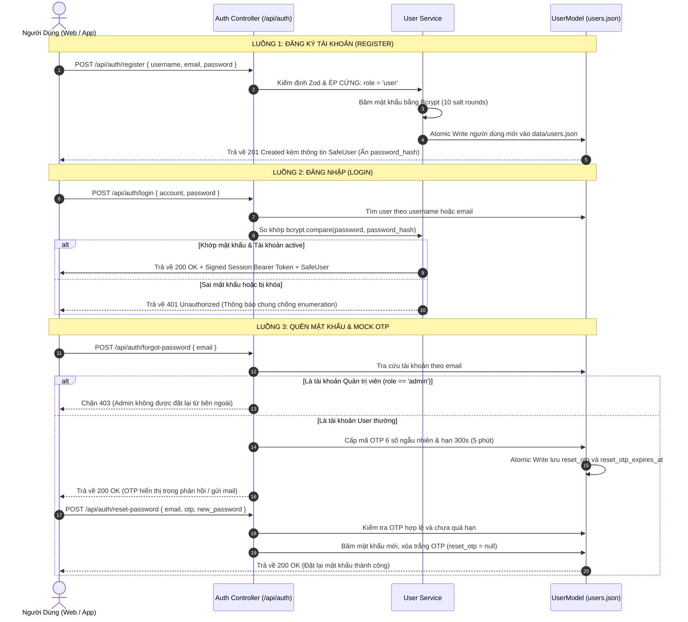
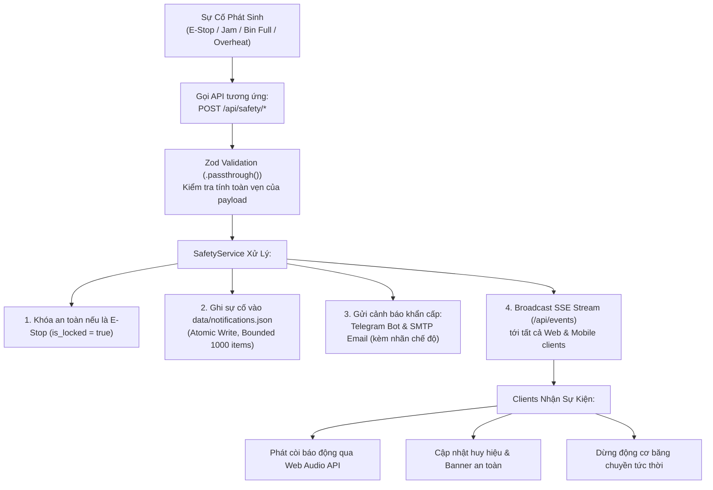
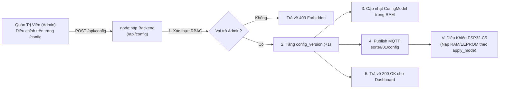

# TÀI LIỆU ĐẶC TẢ RESTFUL API & SSE (SORTIX API SPECIFICATION)

> **Dự án**: SortiX Dashboard — Hệ thống giám sát và phân loại sản phẩm trên băng chuyền IoT.  
> **Kiến trúc phục vụ**: Cung cấp đồng thời qua Next.js App Router (`/api/*` tại Port 3000) và Standalone `node:http` Server (`/api/*` tại Port 5000).
> **Định dạng dữ liệu**: JSON (`application/json; charset=utf-8`) cho các route thông thường; `/api/events` dùng `text/event-stream`. Phản hồi có các field hiện được từng route triển khai như sau (không phải mọi route đều có đủ tất cả field):
> ```json
> {
>   "success": boolean,
>   "message"?: string,
>   "data"?: any,
>   "error"?: any
> }
> ```

---

## Ghi chú endpoint đang chạy

Phần đặc tả chi tiết bên dưới được giữ lại để mô tả payload, RBAC và vòng đời sự kiện. Bảng này là danh sách route đối chiếu với source hiện tại, đặc biệt cho các route safety có alias tương thích:

| Nhóm | Route backend standalone hiện tại |
| --- | --- |
| Health/telemetry | `GET /api/health`, `GET /api/telemetry`, `GET /api/bins` |
| Auth | `POST /api/auth/register`, `/login`, `/logout`, `/forgot-password`, `/reset-password` |
| Core data | `GET/POST /api/config`, `GET/POST/DELETE /api/history`, `GET /api/stats`, `GET /api/notifications` |
| Events/sync | `GET /api/events`, `GET/POST /api/sync` |
| Alerts/chat | `POST /api/email-alert`, `POST /api/telegram-alert`, `GET/POST /api/chat/telegram` |
| User | `GET /api/user/profile`, `POST /api/user/change-password`, `GET/POST /api/users`, `PUT/DELETE /api/users/:id` |
| Safety | `GET /api/safety/status`; POST `/api/safety/estop`, `/jam`, `/bin-full`, `/temp-warning`, `/device-offline`, `/heartbeat`, `/shift-summary`, `/mqtt-disconnected`, `/mqtt-connected`, `/unlock` |

Safety aliases hiện được giữ cho client/firmware: `/api/storage/bin-status`, `/api/telemetry/temp`, `/api/device/offline`, `/api/heartbeat`, `/api/telemetry/heartbeat`, `/api/shift/summary`, `/api/mqtt/disconnected` và `/api/mqtt/connected`. Frontend route handlers có thể có tập route nhỏ hơn backend standalone; không coi hai lớp là một router duy nhất.

Persistence runtime của backend là JSON store và config in-memory. Các bảng CSDL trong phần mapping chỉ mô tả migration tham chiếu trong `backend/database`, không có driver CSDL được gọi bởi script hiện tại.

## 📌 Mục Lục
1. [Kiến Trúc Tương Tác Cơ Sở Dữ Liệu & Luồng API (API Data & Database Architecture)](#1-kiến-trúc-tương-tác-cơ-sở-dữ-liệu--luồng-api-api-data--database-architecture)
   - 1.1. [Bảng Ánh Xạ Endpoint Với Cơ Sở Dữ Liệu (Endpoint-to-Database Mapping)](#11-bảng-ánh-xạ-endpoint-với-cơ-sở-dữ-liệu-endpoint-to-database-mapping)
   - 1.2. [Sơ Đồ Luồng Xác Thực & Quản Lý Mã OTP (Auth & OTP Lifecycle Flow)](#12-sơ-đồ-luồng-xác-thực--quản-lý-mã-otp-auth--otp-lifecycle-flow)
   - 1.3. [Sơ Đồ Luồng Vòng Đời Sự Cố An Toàn (Safety Incident Lifecycle Flow)](#13-sơ-đồ-luồng-vòng-đời-sự-cố-an-toàn-safety-incident-lifecycle-flow)
   - 1.4. [Sơ Đồ Luồng Phân Phối Cấu Hình (Config Distribution Flow)](#14-sơ-đồ-luồng-phân-phối-cấu-hình-config-distribution-flow)
2. [Xác Thực & Quản Trị Người Dùng (`/api/auth` & `/api/users`)](#2-xác-thực--quản-trị-người-dùng)
3. [Cấu Hình Quy Tắc Phân Loại Băng Tải (`/api/config`)](#3-cấu-hình-quy-tắc-phân-loại-băng-tải)
4. [Lịch Sử Phân Loại Sản Phẩm (`/api/history`)](#4-lịch-sử-phân-loại-sản-phẩm)
5. [Thống Kê Tổng Hợp Sản Lượng & KPI (`/api/stats`)](#5-thống-kê-tổng-hợp-sản-lượng--kpi)
6. [Hệ Thống Thông Báo & Cảnh Báo Khẩn Cấp (`/api/notifications`, `/api/email-alert`, `/api/telegram-alert`)](#6-hệ-thống-thông-báo--cảnh-báo-khẩn-cấp)
7. [An Toàn Công Nghiệp & Quản Lý Sự Cố (`/api/safety/*`)](#7-an-toàn-công-nghiệp--quản-lý-sự-cố)
8. [Luồng Dữ Liệu Thời Gian Thực Server-Sent Events (`/api/events`)](#8-luồng-dữ-liệu-thời-gian-thực-server-sent-events)
9. [Danh Mục Mã Trạng Thái HTTP & Xử Lý Ngoại Lệ](#9-danh-mục-mã-trạng-thái-http--xử-lý-ngoại-lệ)

---

## 1. Kiến Trúc Tương Tác Cơ Sở Dữ Liệu & Luồng API (API Data & Database Architecture)

Mọi API trong SortiX Dashboard đều được thiết kế phân lớp nghiêm ngặt: **Route -> Controller -> Service -> Model -> Database / Data Store**.

### 1.1. Bảng Ánh Xạ Endpoint Với Cơ Sở Dữ Liệu (Endpoint-to-Database Mapping)

| Nhóm API | Endpoint | HTTP Method | Model Phụ Trách | Tệp Lưu Trữ / Bảng CSDL | Cơ Chế Ghi Dữ Liệu | Quyền Hạn (RBAC) |
| :--- | :--- | :---: | :--- | :--- | :--- | :---: |
| **Auth** | `/api/auth/register` | `POST` | `UserModel` | `data/users.json` / Bảng `users` | Atomic Write (`.tmp` -> `rename`) | Public (Tự do, ép role `user`) |
| **Auth** | `/api/auth/login` | `POST` | `UserModel` | `data/users.json` / Bảng `users` | Read & Verify Bcrypt (10 rounds) | Public |
| **Auth** | `/api/auth/forgot-password` | `POST` | `UserModel` | `data/users.json` / Bảng `users` | Atomic Write (Cập nhật OTP) | Public (Chặn Admin) |
| **Auth** | `/api/auth/reset-password` | `POST` | `UserModel` | `data/users.json` / Bảng `users` | Atomic Write (Reset hash & xóa OTP) | Public |
| **User** | `/api/user/change-password` | `POST` | `UserModel` | `data/users.json` / Bảng `users` | Atomic Write (Cập nhật hash mới) | Đã đăng nhập (`Bearer Token`) |
| **Users**| `/api/users` | `GET`/`POST` | `UserModel` | `data/users.json` / Bảng `users` | Read / Atomic Write | `admin` Only |
| **Users**| `/api/users/:id` | `PUT`/`DELETE` | `UserModel` | `data/users.json` / Bảng `users` | Atomic Write (Có kiểm tra bảo vệ Admin) | `admin` Only |
| **Config**| `/api/config` | `GET` | `ConfigModel`| RAM / Bảng `sorter_config` | In-Memory Read | Đã đăng nhập |
| **Config**| `/api/config` | `POST` | `ConfigModel`| RAM / MQTT Topic `sorter/01/config` | In-Memory Write & Publish MQTT | `admin` Only |
| **History**| `/api/history` | `GET` | `HistoryModel`| `data/history.json` / Bảng `history` | In-Memory Read (Phân trang) | Đã đăng nhập |
| **History**| `/api/history` | `POST` | `HistoryModel`| `data/history.json` / Bảng `history` | Bounded Buffer (1000 items) + Atomic Write | Đã đăng nhập |
| **History**| `/api/history` | `DELETE` | `HistoryModel`| `data/history.json` / Bảng `history` | Atomic Clear | `admin` Only |
| **Stats** | `/api/stats` | `GET` | `HistoryModel`| `data/history.json` | Tổng hợp KPI tức thời từ bộ nhớ | Đã đăng nhập |
| **Notif** | `/api/notifications` | `GET` | `NotificationModel`| `data/notifications.json` | Read sorted by timestamp | Đã đăng nhập |
| **Notif** | `/api/notifications/:id/resolve`| `PUT`| `NotificationModel`| `data/notifications.json` | Mô tả thiết kế; không có HTTP route tương ứng trong source hiện tại | `admin` Only |
| **Safety**| `/api/safety/estop` | `POST` | `NotificationModel` & `SafetyService` | `data/notifications.json` | Atomic Write + SSE Broadcast | Đã đăng nhập |
| **Safety**| `/api/safety/unlock` | `POST` | `NotificationModel` & `SafetyService` | `data/notifications.json` | Atomic Update + 5s Grace Period + SSE | `admin` Only |
| **Safety**| `/api/safety/jam` | `POST` | `NotificationModel` | `data/notifications.json` | Atomic Write + SSE Broadcast | Đã đăng nhập |
| **Safety**| `/api/safety/bin-full` | `POST` | `NotificationModel` | `data/notifications.json` | Atomic Write + SSE Broadcast | Đã đăng nhập |
| **Safety**| `/api/safety/temp-warning` | `POST` | `NotificationModel` | `data/notifications.json` | Atomic Write + SSE Broadcast | Đã đăng nhập |
| **Safety**| `/api/safety/device-offline`| `POST` | `NotificationModel` | `data/notifications.json` | Atomic Write + SSE Broadcast | Đã đăng nhập |
| **Safety**| `/api/safety/shift-summary` | `POST` | `NotificationModel` | `data/notifications.json` | Atomic Write + SSE Broadcast | Đã đăng nhập |
| **Safety**| `/api/safety/mqtt-disconnected` / `/api/safety/mqtt-connected` | `POST` | `NotificationModel` & `SafetyService` | `data/notifications.json` | Atomic Write/resolve + SSE Broadcast | Đã đăng nhập |

---

### 1.2. Sơ Đồ Luồng Xác Thực & Quản Lý Mã OTP (Auth & OTP Lifecycle Flow)



---

### 1.3. Sơ Đồ Luồng Vòng Đời Sự Cố An Toàn (Safety Incident Lifecycle Flow)



---

### 1.4. Sơ Đồ Luồng Phân Phối Cấu Hình (Config Distribution Flow)



---

## 2. Xác Thực & Quản Trị Người Dùng

### 2.1. Đăng Ký Tài Khoản Mới
Cho phép người dùng tạo tài khoản mới. Luôn tự động gán vai trò `user` nhằm ngăn chặn leo thang đặc quyền.

- **Method**: `POST`
- **Path**: `/api/auth/register`
- **Database Model**: `UserModel` -> Ghi vào `data/users.json` (Atomic Write)
- **Headers**: `Content-Type: application/json`
- **Request Body**:
```json
{
  "full_name": "Nguyễn Văn A",
  "username": "nguyenvana",
  "email": "vana@gmail.com",
  "password": "Password123@",
  "confirm_password": "Password123@"
}
```
- **Response `201 Created`**:
```json
{
  "success": true,
  "message": "Đăng ký tài khoản thành công",
  "data": {
    "id": "usr-1789661442408-kwp0",
    "username": "nguyenvana",
    "full_name": "Nguyễn Văn A",
    "email": "vana@gmail.com",
    "role": "user",
    "status": "active",
    "created_at": "2026-09-18T01:00:00.000Z"
  }
}
```

---

### 2.2. Đăng Nhập Hệ Thống
Xác thực tài khoản qua username hoặc email, so khớp mật khẩu băm Bcrypt (10 salt rounds).

- **Method**: `POST`
- **Path**: `/api/auth/login`
- **Database Model**: `UserModel` -> Đọc và xác thực từ `data/users.json`
- **Headers**: `Content-Type: application/json`
- **Request Body**:
```json
{
  "account": "admin1",
  "password": "password123"
}
```
- **Response `200 OK`**:
```json
{
  "success": true,
  "message": "Đăng nhập thành công",
  "data": {
    "token": "usr-admin-001-sig.eyJhbGciOi...",
    "user": {
      "id": "admin-001",
      "username": "admin1",
      "full_name": "Nguyễn Tá Duy Phong",
      "email": "admin1@gmail.com",
      "role": "admin",
      "status": "active"
    }
  }
}
```
- **Response `401 Unauthorized`**: Mật khẩu hoặc tài khoản không chính xác, hoặc tài khoản đang bị khóa (`status: 'locked'`).

---

### 2.3. Đăng Xuất Hệ Thống
Hủy session cookie và thu hồi token xác thực phiên làm việc.

- **Method**: `POST`
- **Path**: `/api/auth/logout`
- **Headers**: `Authorization: Bearer <TOKEN>`
- **Response `200 OK`**:
```json
{
  "success": true,
  "message": "Đăng xuất thành công"
}
```

---

### 2.4. Lấy Thông Tin Phiên & Token Hiện Tại
Route hiện tại dùng để cấp token phiên từ `id`/`username`/`role` trong body tại Next.js route handler; nó không phải endpoint đọc phiên `GET`.

- **Method**: `POST`
- **Path**: `/api/auth/token`
- **Request Body**: JSON có thể chứa `id`, `username` hoặc `role` theo logic trong `frontend/src/app/api/auth/token/route.ts`.
- **Response `200 OK`**:
```json
{
  "success": true,
  "data": {
    "authenticated": true,
    "user": {
      "id": "admin-001",
      "username": "admin1",
      "full_name": "Nguyễn Tá Duy Phong",
      "email": "admin1@gmail.com",
      "role": "admin",
      "status": "active"
    }
  }
}
```

---

### 2.5. Nhịp Tim Phiên Người Dùng (Session Heartbeat)
Duy trì trạng thái trực tuyến (`is_online`) và cập nhật thời gian hoạt động gần nhất của người dùng.

- **Method**: `POST` (Next.js route handler; backend standalone không có endpoint này)
- **Path**: `/api/auth/heartbeat`
- **Headers**: `Authorization: Bearer <TOKEN>`
- **Response `200 OK`**: `{ "success": true, "data": <SafeUser> }`, với `data` lấy từ `toSafeUser(refreshed)`.

---

### 2.6. Yêu Cầu Mã OTP Quên Mật Khẩu
Gửi mã Mock OTP xác nhận đến email người dùng để đặt lại mật khẩu (hiệu lực 5 phút).

- **Method**: `POST`
- **Path**: `/api/auth/forgot-password`
- **Database Model**: `UserModel` -> Cập nhật `reset_otp` và `reset_otp_expires_at`
- **Headers**: `Content-Type: application/json`
- **Request Body**:
```json
{
  "email": "vana@gmail.com"
}
```
- **Response `200 OK`**:
```json
{
  "success": true,
  "message": "Mã OTP xác thực đã được gửi tới email của bạn (Hiệu lực trong 5 phút)",
  "data": {
    "email": "vana@gmail.com",
    "expires_in_seconds": 300
  }
}
```
> [!WARNING]
> **Bảo mật:** Các tài khoản Quản trị viên (`role: 'admin'`) bị từ chối khôi phục mật khẩu từ bên ngoài màn hình Login để ngăn ngừa tấn công chiếm quyền.

---

### 2.7. Đặt Lại Mật Khẩu Bằng Mã OTP
Xác thực mã OTP 6 chữ số và thiết lập mật khẩu mới.

- **Method**: `POST`
- **Path**: `/api/auth/reset-password`
- **Database Model**: `UserModel` -> Băm mật khẩu mới và xóa sạch OTP
- **Request Body**:
```json
{
  "email": "vana@gmail.com",
  "otp": "839201",
  "new_password": "NewPassword123@",
  "confirm_password": "NewPassword123@"
}
```
- **Response `200 OK`**:
```json
{
  "success": true,
  "message": "Đặt lại mật khẩu thành công. Vui lòng đăng nhập bằng mật khẩu mới."
}
```

---

### 2.8. Đổi Mật Khẩu Nội Bộ (Sau khi đã đăng nhập)
- **Method**: `POST`
- **Path**: `/api/user/change-password`
- **Headers**: `Content-Type: application/json`, `Authorization: Bearer <TOKEN>`
- **Request Body**:
```json
{
  "current_password": "OldPassword123@",
  "new_password": "NewPassword123@",
  "confirm_password": "NewPassword123@"
}
```
- **Response `200 OK`**:
```json
{
  "success": true,
  "message": "Đổi mật khẩu thành công"
}
```

---

### 2.9. Quản Lý Danh Sách Người Dùng (Admin Only)
- **`GET /api/users`**: Lấy danh sách tài khoản (`200 OK`).
- **`POST /api/users`**: Tạo tài khoản người dùng hoặc quản trị viên mới (`201 Created`).
- **`PUT /api/users/:id`**: Cập nhật thông tin, thay đổi vai trò hoặc khóa/mở tài khoản (`200 OK`).
- **`DELETE /api/users/:id`**: Xóa tài khoản người dùng (`200 OK`).
  - *Ràng buộc 1*: Admin không thể tự xóa chính mình khi đang đăng nhập (`400 Bad Request`).
  - *Ràng buộc 2*: Không thể xóa Admin nếu hệ thống chỉ còn 1 Quản trị viên (`400 Bad Request`).

---

## 3. Cấu Hình Quy Tắc Phân Loại Băng Tải

### 3.1. Lấy Cấu Hình Hiện Tại
- **Method**: `GET`
- **Path**: `/api/config`
- **Database Model**: `ConfigModel` -> Trả về cấu hình từ RAM
- **Response `200 OK`**:
```json
{
  "success": true,
  "data": {
    "schema_version": 1,
    "config_version": 3,
    "device_id": "sorter_01",
    "catalog_version": "catalog_01",
    "updated_at": "2026-09-18T10:00:00.000Z",
    "updated_by": "admin1",
    "rules": {
      "med_syringe": 1,
      "med_forceps": 2,
      "med_scissors": 2,
      "med_vial": 3
    },
    "default_bin": 3,
    "bin_capacities": {
      "bin_1": 50,
      "bin_2": 50,
      "bin_3": 50
    },
    "conveyor_speed": 1.2,
    "apply_mode": "when_line_empty"
  }
}
```

### 3.2. Cập Nhật Cấu Hình & Dung Lượng Khay (Admin Only)
- **Method**: `POST`
- **Path**: `/api/config`
- **Database Model**: `ConfigModel` -> Cập nhật RAM & Xuất bản MQTT `sorter/01/config`
- **Headers**: `Content-Type: application/json`, `Authorization: Bearer <TOKEN>`
- **Request Body**:
```json
{
  "rules": {
    "med_syringe": 1,
    "med_forceps": 2,
    "med_scissors": 2,
    "med_vial": 3
  },
  "default_bin": 3,
  "bin_capacities": {
    "bin_1": 30,
    "bin_2": 40,
    "bin_3": 50
  },
  "conveyor_speed": 1.5,
  "apply_mode": "when_line_empty"
}
```
- **Response `200 OK`**: Trả về cấu hình mới với `config_version` tăng tự động.

---

## 4. Lịch Sử Phân Loại Dụng Cụ Y Tế

### 4.1. Truy Vấn Danh Sách Lịch Sử
- **Method**: `GET`
- **Path**: `/api/history`
- **Database Model**: `HistoryModel` -> Phân trang từ Bounded Buffer (`data/history.json`)
- **Query Parameters**:
  - `page`: Số trang (mặc định: `1`).
  - `limit`: Số bản ghi mỗi trang (mặc định: `20`, tối đa: `100`).
  - `brand`: Lọc theo nhóm dụng cụ (`med_syringe`, `med_forceps`, `med_scissors`, `med_vial`).
  - `bin`: Lọc theo khay (`1`, `2`, `3`).
  - `status`: Lọc theo kết quả (`success`, `misplaced`, `rejected`).
  - `date_from`, `date_to`: Khoảng thời gian ISO-8601.
- **Response `200 OK`**:
```json
{
  "success": true,
  "data": {
    "items": [
      {
        "id": "rec-1789735712",
        "product_id": "MED-0042",
        "brand": "med_syringe",
        "target_bin": 1,
        "actual_bin": 1,
        "status": "success",
        "confidence": 0.96,
        "timestamp": "2026-09-18T12:48:32.000Z"
      }
    ],
    "pagination": {
      "page": 1,
      "limit": 20,
      "total_items": 1250,
      "total_pages": 63
    }
  }
}
```

### 4.2. Thêm Bản Ghi Phân Loại
- **Method**: `POST`
- **Path**: `/api/history`
- **Database Model**: `HistoryModel` -> Thêm vào Bounded Buffer 1.000 bản ghi
- **Response `201 Created`**.

### 4.3. Xóa / Dọn Dẹp Lịch Sử (Admin Only)
- **Method**: `DELETE`
- **Path**: `/api/history`
- **Database Model**: `HistoryModel` -> Dọn sạch RAM và `data/history.json`
- **Headers**: `Authorization: Bearer <TOKEN>`
- **Response `200 OK`**: Xóa toàn bộ lịch sử trong bộ nhớ và trả về xác nhận.

---

## 5. Thống Kê Tổng Hợp Sản Lượng & KPI

- **Method**: `GET`
- **Path**: `/api/stats`
- **Database Model**: `HistoryModel` -> Tính toán KPI tức thời
- **Response `200 OK`**:
```json
{
  "success": true,
  "data": {
    "total_sorted": 1250,
    "success_count": 1180,
    "error_count": 70,
    "accuracy_rate": 94.4,
    "bin_counts": {
      "bin_1": 45,
      "bin_2": 38,
      "bin_3": 17
    },
    "brand_breakdown": {
      "med_syringe": 450,
      "med_forceps": 400,
      "med_scissors": 250,
      "med_vial": 150
    },
    "hourly_distribution": [
      { "hour": "08:00", "count": 120 },
      { "hour": "09:00", "count": 145 }
    ]
  }
}
```

---

## 6. Hệ Thống Thông Báo & Cảnh Báo Khẩn Cấp

### 6.1. Danh Sách Sự Cố & Cảnh Báo
- **Method**: `GET`
- **Path**: `/api/notifications`
- **Database Model**: `NotificationModel` -> Đọc từ `data/notifications.json`
- **Query Parameters**: `status` (`unprocessed`, `resolved`), `severity` (`info`, `warning`, `critical`).
- **Response `200 OK`**: Danh sách thông báo (tối đa 1.000 sự cố gần nhất).

### 6.2. Đánh Dấu Sự Cố Đã Xử Lý
- **Trạng thái source hiện tại**: Chưa có HTTP route `PUT /api/notifications/:id/resolve` trong Next route handlers hoặc backend standalone. Đoạn dưới mô tả hợp đồng dự kiến và không nên được client gọi như API đã triển khai.
- **Method**: `PUT`
- **Path**: `/api/notifications/:id/resolve`
- **Database Model**: `NotificationModel` -> Atomic Update (`status = 'resolved'`)
- **Headers**: `Authorization: Bearer <TOKEN>`
- **Response `200 OK`**: Cập nhật trạng thái `resolved`, gắn `resolved_at` và `resolved_by`.

### 6.3. Gửi Email Cảnh Báo (SMTP)
- **Method**: `POST`
- **Path**: `/api/email-alert`
- **Request Body**:
```json
{
  "event": "emergency_stop",
  "title": "[NGUY HIỂM] Dừng Khẩn Cấp Băng Tải",
  "description": "Nút dừng khẩn cấp tại trạm 01 được kích hoạt",
  "is_simulation": false
}
```
- **Response `200 OK`**: Đã chuyển tiếp email thành công.

### 6.4. Gửi Tin Nhắn Telegram Bot
- **Method**: `POST`
- **Path**: `/api/telegram-alert`
- **Request Body**: Tương tự email alert, tự động chèn cờ `🧪 Chế độ Giả Lập` hoặc `🔴 Phần cứng Thực Tế`.
- **Response `200 OK`**.

---

## 7. An Toàn Công Nghiệp & Quản Lý Sự Cố

### 7.1. Dừng Khẩn Cấp (E-Stop)
- **Method**: `POST`
- **Path**: `/api/safety/estop`
- **Database Model**: `NotificationModel` -> Ghi sự cố `is_locked = true`, severity `critical`
- **Request Body**:
```json
{
  "station_id": "STATION_01",
  "triggered_by": "Physical E-Stop Button #1",
  "is_simulation": false
}
```
- **Response `200 OK`**: Hệ thống khóa an toàn (`is_locked: true`), lưu sự cố vào `notifications.json`, phát còi hú và broadcast SSE `emergency_stop`.

### 7.2. Mở Khóa An Toàn (Admin Only)
- **Method**: `POST`
- **Path**: `/api/safety/unlock`
- **Database Model**: `NotificationModel` -> Cập nhật `is_locked = false`, ghi nhận `reason`
- **Headers**: `Authorization: Bearer <TOKEN>`
- **Request Body**:
```json
{
  "admin_id": "admin-001",
  "reason": "Đã kiểm tra hiện trường an toàn và dọn sạch vật cản"
}
```
- **Response `200 OK`**: Mở khóa an toàn (`is_locked: false`), kích hoạt thời gian ân hạn 5 giây chống lặp echo tín hiệu.

### 7.3. Trạng Thái An Toàn Hiện Tại
- **Method**: `GET`
- **Path**: `/api/safety/status`
- **Response `200 OK`**:
```json
{
  "success": true,
  "data": {
    "is_locked": false,
    "locked_at": null,
    "last_incident": null
  }
}
```

### 7.4. Cảnh Báo Kẹt Phôi (Jam Incident)
- **Method**: `POST`
- **Path**: `/api/safety/jam`
- **Request Body**:
```json
{
  "event": "jam_detected",
  "station_id": "Conveyor_Belt_Zone_A",
  "sensor_id": "OPTICAL_JAM_02",
  "duration_seconds": 5.2,
  "is_simulation": false
}
```

### 7.5. Cảnh Báo Đầy Khay (Bin Full)
- **Method**: `POST`
- **Path**: `/api/safety/bin-full`
- **Request Body**:
```json
{
  "event": "bin_full",
  "station_id": "BIN_RED_01",
  "bin_id": "bin_1",
  "current_count": 50,
  "max_capacity": 50
}
```

### 7.6. Cảnh Báo Quá Nhiệt (Temperature Warning)
- **Method**: `POST`
- **Path**: `/api/safety/temp-warning` (alias: `/api/telemetry/temp`)
- **Request Body**:
```json
{
  "event": "temperature_warning",
  "station_id": "Main_Drive_Motor",
  "temperature": 79.5,
  "threshold": 75.0
}
```

### 7.7. Mất Kết Nối Thiết Bị & Nhịp Tim (Device Offline & Heartbeat)
- **`POST /api/safety/device-offline`**: Kích hoạt cảnh báo vi điều khiển ngoại tuyến (`device_offline`).
- **`POST /api/safety/heartbeat`**: Nhận gói tin ping chu kỳ 2s (`conveyor/heartbeat`), cập nhật watchdog.

### 7.8. Báo Cáo 1 Ngày Làm Việc (Shift Summary)
- **Method**: `POST`
- **Path**: `/api/safety/shift-summary`
- **Request Body**:
```json
{
  "event": "shift_summary",
  "station_id": "SHIFT_SUPERVISOR",
  "total_sorted": 1250,
  "success_count": 1180,
  "error_count": 70,
  "accuracy_rate": 94.4,
  "estop_count": 1,
  "shift_name": "Ca 1 - Buổi sáng",
  "is_simulation": false
}
```

### 7.9. Trạng Thái Kết Nối MQTT
- **Method**: `POST`
- **Path**: `/api/safety/mqtt-disconnected` hoặc `/api/safety/mqtt-connected`
- **Alias**: `/api/mqtt/disconnected`, `/api/mqtt/connected`
- **Request Body**:
```json
{
  "status": "disconnected",
  "broker_url": "wss://broker.emqx.io:8084/mqtt",
  "duration": 5.1,
  "attempt": 1
}
```

---

## 8. Luồng Dữ Liệu Thời Gian Thực Server-Sent Events

### Endpoint Kênh SSE:
- **Path**: `/api/events`
- **Method**: `GET`
- **Headers**:
  ```http
  Accept: text/event-stream
  Cache-Control: no-cache
  Connection: keep-alive
  ```

### Các sự kiện phát sóng (Event Names):
| Tên sự kiện | Mô tả | Dữ liệu kèm theo |
| :--- | :--- | :--- |
| `emergency_stop` | Kích hoạt dừng khẩn cấp | Chi tiết sự cố trạm, thời gian, người kích hoạt |
| `safety_unlocked` | Quản trị viên mở khóa hệ thống | Admin ID, ghi chú hiện trường |
| `jam_detected` | Kẹt phôi tại cảm biến quang | Vị trí Zone A, cảm biến, thời gian kẹt |
| `bin_full` | Khay phân loại đạt sức chứa định mức | Mã khay, số lượng đạt ngưỡng |
| `temperature_warning` | Nhiệt độ động cơ / CPU vượt ngưỡng | Tên thiết bị, nhiệt độ đo, ngưỡng |
| `device_offline` | Vi điều khiển ESP32 mất kết nối | Station ID, thời gian mất gói tin cuối |
| `device_online` | Vi điều khiển ESP32 kết nối lại | Station ID, IP, thời gian phục hồi |
| `mqtt_disconnected` | Mất kết nối MQTT Broker > 5s | URL Broker, số lần thử kết nối |
| `mqtt_connected` | Phục hồi kết nối MQTT Broker | URL Broker, thời gian phục hồi |
| `shift_summary` | Tổng kết báo cáo ca 1 ngày làm việc | Thống kê sản lượng, tỷ lệ đạt/lỗi |
| `notification` | Cảnh báo hệ thống chung | Nội dung thông báo mới thêm vào kho lưu trữ |

---

## 9. Danh Mục Mã Trạng Thái HTTP & Xử Lý Ngoại Lệ

| Mã HTTP | Trạng thái | Ý nghĩa trong hệ thống SortiX |
| :--- | :--- | :--- |
| **`200 OK`** | Thành công | Yêu cầu truy vấn hoặc cập nhật xử lý hoàn tất |
| **`201 Created`** | Đã tạo mới | Tạo tài khoản, bản ghi lịch sử hoặc cấu hình mới thành công |
| **`400 Bad Request`** | Dữ liệu không hợp lệ | Payload Zod sai định dạng, tự xóa tài khoản chính mình, xóa Admin cuối cùng |
| **`401 Unauthorized`** | Chưa xác thực | Thiếu token Bearer, token sai chữ ký hoặc đã hết hạn |
| **`403 Forbidden`** | Không có quyền | Người dùng vai trò `user` cố tình gọi API chỉ dành cho `admin` |
| **`404 Not Found`** | Không tìm thấy | Không tìm thấy ID tài khoản, cấu hình hoặc thông báo sự cố |
| **`429 Too Many Requests`** | Vượt giới hạn tần suất | Rate limit email/telegram hoặc thử mật khẩu sai quá nhiều lần |
| **`500 Internal Server Error`** | Lỗi máy chủ | Lỗi đọc ghi file, lỗi phân giải hạ tầng ngoài dự kiến |
