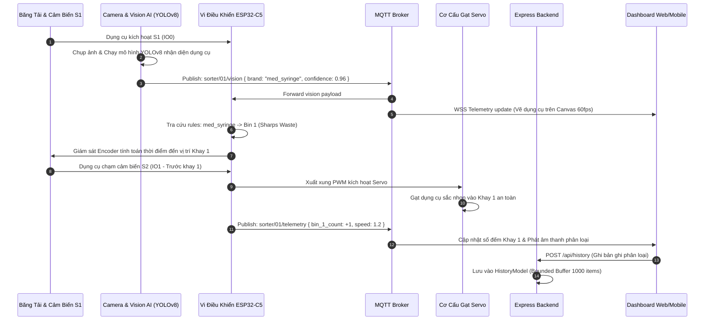
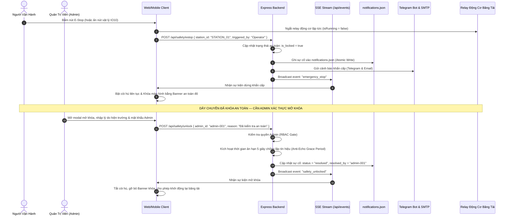
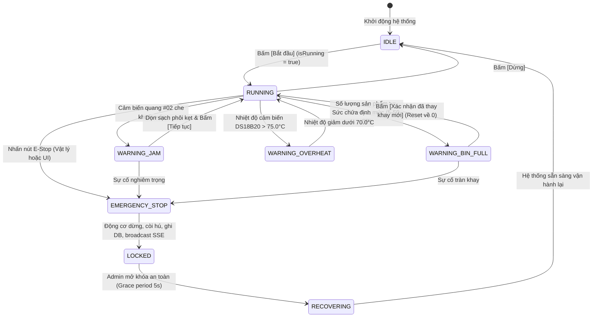
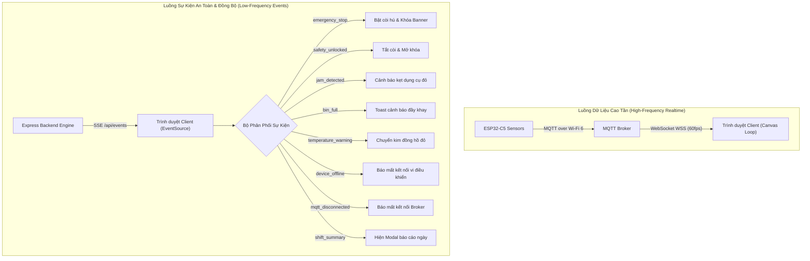
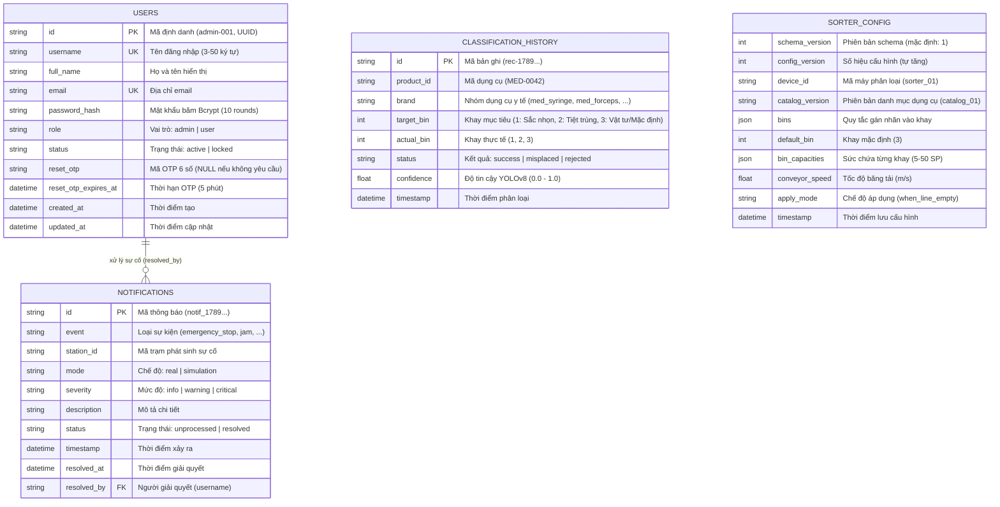

# THIẾT KẾ KIẾN TRÚC HỆ THỐNG SORTIX-MED (BIOMEDICAL & INDUSTRIAL IOT ARCHITECTURE)

> **Tài liệu Kỹ Thuật Đồ Án PBL3**: Hệ thống điều khiển, giám sát và tự động phân loại dụng cụ y tế sau phẫu thuật chuẩn bị cho quy trình khử trùng Autoclave phòng mổ. Tích hợp vi điều khiển IoT (**ESP32-C5**), camera thị giác máy tính (**YOLOv8 AI**), bảng điều khiển quản trị phân tầng và ứng dụng di động đa nền tảng (Android APK & iOS PWA) từ một cơ sở mã nguồn duy nhất (1-Codebase Hybrid Architecture).

---

## 📌 Mục Lục
1. [Tổng Quan Kiến Trúc (High-Level Architecture)](#1-tổng-quan-kiến-trúc-high-level-architecture)
2. [Phân Tích Chi Tiết Từng Tầng (Layer Breakdown)](#2-phân-tích-chi-tiết-từng-tầng-layer-breakdown)
   - 2.1. Shared Layer (`shared/`)
   - 2.2. Backend Layer (`backend/`)
   - 2.3. Frontend Web Layer (`frontend/`)
   - 2.4. Mobile Shell Layer (Capacitor Android & iOS PWA)
   - 2.5. IoT & Hardware Layer (ESP32-C5, Sensors & Actuators)
3. [Luồng Hoạt Động & Quy Trình Tuần Tự (Detailed Workflows & Sequence Diagrams)](#3-luồng-hoạt-động--quy-trình-tuần-tự-detailed-workflows--sequence-diagrams)
   - 3.1. Sơ Đồ Tuần Tự: Luồng Phân Loại Dụng Cụ Y Tế Thực Tế (End-to-End Sorting Pipeline)
   - 3.2. Sơ Đồ Tuần Tự: Luồng Dừng Khẩn Cấp (E-Stop) & Mở Khóa An Toàn (Safe Unlock)
   - 3.3. Sơ Đồ Máy Trạng Thái Hệ Thống (System State Machine)
   - 3.4. Sơ Đồ Phân Phối Telemetry & Broadcast SSE
4. [Kiến Trúc & Cơ Chế Hoạt Động Của Cơ Sở Dữ Liệu (Database Architecture)](#4-kiến-trúc--cơ-chế-hoạt-động-của-cơ-sở-dữ-liệu-database-architecture)
   - 4.1. Sơ Đồ Quan Hệ Thực Thể (Entity Relationship Diagram - ERD)
   - 4.2. Chiến Lược Lưu Trữ 2 Tầng (Dual-Mode Persistence: JSON vs RDBMS/NoSQL)
   - 4.3. Thuật Toán Ghi Nguyên Tử Chống Hỏng File (Atomic File Write Algorithm)
   - 4.4. Cơ Chế Giới Hạn Bộ Nhớ Đệm An Toàn (Bounded Buffers - 1.000 Items)
   - 4.5. Phân Tích Thiết Kế DDL Migrations (PostgreSQL, MySQL, SQLite, MongoDB)
   - 4.6. Cơ Chế Đồng Bộ 3 Lớp: LocalStorage <-> RAM Cache <-> Persistent Storage
5. [Mô Hình Bảo Mật & Ràng Buộc An Toàn (Security Architecture)](#5-mô-hình-bảo-mật--ràng-buộc-an-toàn-security-architecture)
6. [Kiến Trúc Kiểm Thử & Cổng Chất Lượng (Quality Gates & Testing)](#6-kiến-trúc-kiểm-thử--cổng-chất-lượng-quality-gates--testing)

---

## 1. Tổng Quan Kiến Trúc (High-Level Architecture)

Hệ thống **SortiX-Med** được thiết kế theo mô hình kiến trúc phân tầng chuyên biệt (**Layered Architecture**) và quản lý mã nguồn dưới dạng **Monorepo (npm workspaces)**. Kiến trúc phân định 5 khối chức năng liên kết chặt chẽ:

1. **Frontend Web (Giao diện Client)**: Ứng dụng Next.js 14 App Router, chịu trách nhiệm trực quan hóa đồ họa Canvas 60fps mô phỏng dụng cụ y tế di chuyển, âm thanh công nghiệp tổng hợp qua Web Audio API, đồng hồ nhiệt độ bán nguyệt 2 chế độ, các thanh trượt điều chỉnh dung lượng khay (5-50 SP) và tương tác người dùng.
2. **Mobile Shell Layer (Ứng Dụng Di Động)**: Vỏ bọc Hybrid đa nền tảng sử dụng **Capacitor 8** để đóng gói thành ứng dụng **Android APK** native và hỗ trợ **iOS PWA Standalone** toàn màn hình từ cùng 1 codebase.
3. **Backend API Server**: Máy chủ Express/Node.js độc lập xử lý xác thực, phân quyền RBAC, giám sát an toàn công nghiệp (E-Stop, Kẹt phôi, Khay đầy, Quá nhiệt, Thiết bị offline, Mất kết nối MQTT, Báo cáo 1 ngày làm việc), broadcast SSE và lưu trữ dữ liệu bền vững.
4. **Shared Layer (Tầng Dùng Chung)**: Định nghĩa kiểu dữ liệu (Types), Zod Schemas và hằng số hệ thống dùng chung giữa Frontend, Mobile và Backend.
5. **IoT & Vision Gateway**: Cầu nối truyền thông hai chiều thời gian thực giữa vi điều khiển ESP32-C5, cụm cảm biến S1-S3, 2 cơ cấu Servo gạt phôi và MQTT Broker qua Wi-Fi 6.

```
      ┌────────────────────────────────────────────────────────┐
      │               CROSS-PLATFORM CLIENTS                   │
      │  ┌──────────────────┐            ┌──────────────────┐  │
      │  │ Desktop Browser  │            │ Android App (APK)│  │
      │  │ Chrome/Edge/Brave│            │ Capacitor Bridge │  │
      │  └────────┬─────────┘            └────────┬─────────┘  │
      │           │    ┌──────────────────┐       │            │
      │           └───>│  iOS PWA Safari  │<──────┘            │
      │                │  Standalone Mode │                    │
      │                └────────┬─────────┘                    │
      └─────────────────────────┼──────────────────────────────┘
                                │
                                ▼
      ┌────────────────────────────────────────────────────────┐
      │                 FRONTEND (Next.js 14 App Router)       │
      │  TailwindCSS • HTML5 Canvas 60fps Physics Servo Loop   │
      │  Web Audio Industrial Sound • Dynamic Bin Capacities   │
      │  Dual-Mode Gauge Dial • Báo Cáo 1 Ngày Làm Việc        │
      │  Mobile Drawer Sidebar • Header Quick-Toggle Pill      │
      └───────────┬───────────────────┬────────────┬───────────┘
                  │ Fetch REST API    │ SSE Stream │ WSS (Browser)
                  │ (via Clients)     │ /api/events│
                  ▼                   ▼            ▼
┌─────────────────────────────────────────────┐   ┌────────────────────────┐
│            BACKEND (Server Layer)           │   │    MQTT BROKER / IoT   │
│  - Routes: /api/auth, /api/safety, ...      │   │  (EMQX / Mosquitto)    │
│  - Controllers: safetyController, user, ... │   │  Topics:               │
│  - Services: safetyService, sseService, ... │   │  - sorter/01/telemetry │
│  - Models: notificationModel, userModel     │   │  - sorter/01/vision    │
│  - Security: Bcrypt, OTP, RBAC Middleware   │   │  - sorter/01/control   │
│  - Multi-DB Migrations (SQL / NoSQL)        │   │  - sorter/01/estop     │
│  - Email (SMTP) & Telegram Bot Integration  │   │  - conveyor/sensor/jam │
│  - MQTT Watchdog (5s Debounce, Backoff)     │   │  - conveyor/storage/*  │
│  - Device Heartbeat Watchdog (6s Timeout)   │   │  - conveyor/heartbeat  │
│  - In-Memory Rate Limiting & Safe Bounding  │   │  - conveyor/telemetry/*│
└──────────────────────┬──────────────────────┘   └───────────▲────────────┘
                       │                                      │ Wi-Fi 6
                       ▼                          ┌───────────┴────────────┐
┌─────────────────────────────────────────────┐   │     ESP32-C5 Hardware  │
│          PERSISTENCE & DATA STORE           │   │(Sensors S1-S3, Servo)  │
│  - data/users.json (User Accounts Store)    │   └────────────────────────┘
│  - data/notifications.json (Safety Events)  │
│  - SQLite / PostgreSQL / MySQL / MongoDB    │
└─────────────────────────────────────────────┘
```

---

## 2. Phân Tích Chi Tiết Từng Tầng (Layer Breakdown)

### 2.1. Shared Layer (`shared/`)
Đóng vai trò là nguồn sự thật duy nhất (Single Source of Truth) giữa Client và Server:
- **`types/index.ts`**:
  - `TelemetryData`: Vận tốc encoder, nhiệt độ vi điều khiển, trạng thái cảm biến S1–S3.
  - `VisionDetection`: Nhãn dụng cụ y tế (`med_syringe`, `med_forceps`, `med_scissors`, `med_vial`), độ tin cậy confidence (0.0 – 1.0), timestamp.
  - `SorterConfig`: Cấu hình quy tắc phân loại dụng cụ vào 3 khay chứa, versioning và cơ chế áp dụng.
  - `ClassificationRecord`: Bản ghi phân loại lịch sử (id, product_id, brand, khay đích, khay thực tế, trạng thái).
  - `User`, `SafeUser`, `AuthCredentials`: Kiểu dữ liệu xác thực và quản lý tài khoản.
  - Payloads sự cố an toàn: `EmergencyStopPayload`, `JamDetectedPayload`, `BinFullPayload`, `TemperatureWarningPayload`, `DeviceOfflinePayload`, `HeartbeatPayload`, `ShiftSummaryPayload`, `MqttDisconnectedPayload`.
- **`schemas/index.ts`**:
  - Toàn bộ validation schemas viết bằng **Zod**.
  - **Quy tắc `.passthrough()`**: Tất cả schema tương tác với thiết bị và sự kiện ngoại vi đều kích hoạt `.passthrough()` để firmware ESP32-C5 có thể bổ sung các trường chẩn đoán mới mà không gây crash ứng dụng.
- **`constants/index.ts`**:
  - Danh sách MQTT Topics (`TELEMETRY`, `VISION`, `CONTROL`, `ESTOP`, `JAM`, `BIN_STATUS`, `TEMP`, `HEARTBEAT`).
  - Danh mục nhận diện dụng cụ y tế:
    - `med_syringe`: "Bơm kim tiêm / Dao mổ" (Vàng y tế `#EAB308`, Khay 1)
    - `med_forceps`: "Kẹp phẫu thuật (Pean)" (Xanh dương y tế `#0284C7`, Khay 2)
    - `med_scissors`: "Kéo phẫu thuật" (Xanh tím tiệt trùng `#6366F1`, Khay 2)
    - `med_vial`: "Lọ thuốc / Ống nghiệm" (Xanh ngọc Emerald `#10B981`, Khay 3)
  - Tên 3 Khay phân loại:
    - Khay 1: "Thùng vật sắc nhọn lây nhiễm (Sharps Waste)"
    - Khay 2: "Khay hấp tiệt trùng Autoclave (Surgical Instruments)"
    - Khay 3: "Khay vật tư y tế & Phục hồi / Khay mặc định (General Supplies)"
  - Định mức dung lượng mặc định (50 SP, dải điều chỉnh [5, 50]).
  - Ngưỡng Fail-safe an toàn sinh học: Độ tin cậy `< 60%` tự động đưa về Khay 3.

### 2.2. Backend Layer (`backend/`)
Được thiết kế theo mô hình MVC thu gọn (Model - Controller - Service - Route):
- **Controllers (`backend/src/controllers/`)**:
  - `safetyController.ts`: Tiếp nhận và xử lý sự cố dừng khẩn cấp E-Stop, kẹt phôi, khay đầy, quá nhiệt, thiết bị ngoại tuyến, nhịp tim ping, báo cáo 1 ngày làm việc, mất/phục hồi MQTT, mở khóa an toàn và truy vấn thông báo.
  - `userController.ts`: Đăng ký, đăng nhập, đổi mật khẩu, quên mật khẩu OTP, quản lý danh sách người dùng.
  - `configController.ts`: Tiếp nhận và xuất bản cấu hình phân loại.
  - `historyController.ts`: Lọc, phân trang và dọn dẹp lịch sử phân loại.
  - `statsController.ts`: Tổng hợp số liệu KPI và tỷ lệ phân loại thành công.
  - `alertController.ts`: Xử lý gửi email cảnh báo và thông báo Telegram Bot.
- **Services (`backend/src/services/`)**:
  - `safetyService.ts`: Quản lý trạng thái khóa an toàn (`is_locked`), lưu trữ sự cố vào `notifications.json`, kiểm tra phân quyền mở khóa chỉ dành cho Admin, cơ chế chống kẹt loop echo 5s, và xử lý toàn bộ các sự kiện cảnh báo đa kênh.
  - `sseService.ts`: Quản lý danh sách kết nối SSE clients, broadcast sự kiện khẩn cấp thời gian thực tức thời qua `/api/events`.
  - `userService.ts`: Logic nghiệp vụ băm mật khẩu Bcrypt, cấp phát mã Mock OTP 6 chữ số (thời hạn 5 phút), kiểm tra phân quyền RBAC và ràng buộc an toàn (chặn tự xóa Admin, bảo vệ tối thiểu 1 Admin).
  - `authToken.ts`: Quản lý ký và kiểm tra tính hợp lệ của token phiên làm việc.
  - `alertNotificationService.ts`: Tích hợp Nodemailer (SMTP) và Telegram Bot API kèm gắn nhãn định danh chế độ (`🧪 Chế độ Giả Lập` / `🔴 Phần cứng Thực Tế`) và Rate Limiting chống spam.
  - `historyService.ts` & `configService.ts`: Quản lý nghiệp vụ lịch sử và cấu hình.
- **Models (`backend/src/models/`)**:
  - `notificationModel.ts`: Lưu trữ bền vững các sự cố an toàn vào file `data/notifications.json` qua cơ chế ghi nguyên tử Atomic Write.
  - `userModel.ts`: Thao tác dữ liệu người dùng bền vững trên file `data/users.json`, tích hợp sẵn Admin Seeder khởi tạo 4 tài khoản Ban Quản trị.
  - `historyModel.ts` & `configModel.ts`: Quản lý bộ nhớ đệm an toàn (Bounded Buffer tối đa 1000 bản ghi), loại trừ nguy cơ tràn RAM.
- **Middlewares (`backend/src/middlewares/`)**:
  - `authMiddleware.ts`: Kiểm tra Bearer Token, kiểm tra quyền hạn `requireAdmin`.
  - `validateMiddleware.ts`: Kiểm định đầu vào JSON qua Zod Schema trước khi chạm tới Controller.
  - `errorMiddleware.ts`: Bắt và định dạng lỗi ngoại lệ đồng nhất (`{ success: false, message: ... }`).

### 2.3. Frontend Web Layer (`frontend/`)
Xây dựng trên nền tảng Next.js 14 App Router với hiệu năng tối ưu:
- **Trực quan hóa vật lý 60fps & Cơ Cấu Gạt Servo (`useConveyorPhysics.ts`)**:
  - Vòng lặp `requestAnimationFrame` tính toán tọa độ di chuyển của dụng cụ y tế trên băng chuyền.
  - Mô phỏng cơ cấu **Servo gạt xoay góc** (Servo 1 - PWM IO23, Servo 2 - PWM IO24) gạt dụng cụ vào đúng máng trượt Khay 1 (Sắc nhọn), Khay 2 (Tiệt trùng) hoặc trượt thẳng vào Khay 3 (Vật tư/Fail-safe).
  - Cho phép người dùng **dọn khay chủ động bất kỳ lúc nào** ngay trên giao diện mà không cần đợi đủ định mức.
- **Độ Rộng & Sức Chứa Khay Linh Hoạt (Dynamic Bin Capacities 5 - 50 SP)**:
  - Cung cấp 3 thanh trượt điều chỉnh độ rộng/sức chứa riêng biệt cho từng khay trên `ConveyorVisualizer.tsx`, `BinTrays.tsx`, `LiveHealthAndBinWidget.tsx` và `ConfigAndDiagnostics.tsx`.
  - Tự động lưu trữ và đồng bộ hóa trạng thái qua `useSorterData.ts` và `localStorage ('sortix_bin_capacities')`.
  - Khi số lượng đạt định mức của từng khay, hệ thống kích hoạt cảnh báo đầy khay tương ứng.
- **Đồng Hồ Nhiệt Độ Bán Nguyệt 2 Chế Độ (`TemperatureGaugeWidget.tsx`)**:
  - *Mô phỏng*: Hiển thị thanh trượt nhiệt độ ảo (30°C - 95°C) kèm preset buttons (42.5°C, 72.0°C, 78.5°C) để kiểm thử cảnh báo quá nhiệt.
  - *Thực tế*: Ẩn toàn bộ thanh trượt ảo, hiển thị bảng telemetry phần cứng (ESP32 DS18B20) với cờ `[PHẦN CỨNG THẬT]`.
- **Báo Cáo 1 Ngày Làm Việc (`ShiftSummaryModal.tsx`, `ShiftSummaryToast.tsx`)**:
  - Nút bấm trực tiếp trên `TopHeader.tsx` ("Báo cáo 1 ngày làm việc") và tự động nhắc nhở lúc 17:00.
  - Đồng bộ hóa trực tiếp số liệu thời gian thực từ khay chứa, số sản phẩm đạt/lỗi, thời gian vận hành và số lần E-Stop.
  - Hỗ trợ xuất file CSV có UTF-8 BOM chuẩn tiếng Việt cho Excel và mẫu in báo cáo chuẩn.
- **Giám Sát Mất Kết Nối MQTT (`MqttDisconnectedToast.tsx`, `TopHeader.tsx`)**:
  - Debounce 5 giây chống nhấp nháy mạng ngắn hạn.
  - Tự động đổi huy hiệu trạng thái trên TopHeader: `MQTT: ONLINE (Xanh)` <-> `MQTT: DISCONNECTED (Đỏ chớp nháy)`.
  - Lịch trình tự động kết nối lại (auto-reconnect backoff: 3s -> 5s -> 10s) và Toast phục hồi màu xanh.
- **Bộ tổng hợp âm thanh (`audioService.ts`)**:
  - Ứng dụng Web Audio API thuần của trình duyệt để sinh sóng âm công nghiệp (Sine/Square Oscillator).
  - Hỗ trợ còi báo động khẩn cấp E-Stop hú liên tục, còi báo kẹt phôi, còi báo đầy khay, còi cảnh báo quá nhiệt, âm cảnh báo mất kết nối MQTT và chime phục hồi kết nối.

### 2.4. Mobile Shell Layer (Capacitor Android & iOS PWA)
- **Mô hình 1-Codebase Hybrid Bridge**:
  - Đóng gói giao diện Next.js 14 thành ứng dụng Native Android qua **Capacitor 8**.
  - Không sử dụng chế độ tĩnh `output: 'export'` tĩnh để bảo vệ toàn vẹn 18 dynamic API routes và SSE stream `/api/events`.
  - Trang dự phòng ngoại tuyến `frontend/out/index.html` bảo đảm app không bị sập khi chưa có kết nối mạng.
- **Cấu hình Quyền & Mạng (`AndroidManifest.xml`)**:
  - Kích hoạt `android:usesCleartextTraffic="true"` cho phép giao tiếp HTTP nội bộ trong quá trình phát triển và kết nối vi điều khiển qua IP cục bộ (`http://192.168.1.169:3000`).
  - Cấp các quyền mạng cần thiết: `INTERNET`, `ACCESS_NETWORK_STATE`.
- **Tối ưu Viewport & Giao Diện Cảm Ứng Di Động**:
  - Tích hợp chuẩn Next.js 14 `Viewport` trong `frontend/src/app/layout.tsx`:
    - `viewportFit: "cover"`: Tràn viền thích ứng tai thỏ và đảo Dynamic Island trên thiết bị mới.
    - `maximumScale: 1, userScalable: false`: Vô hiệu hóa tính năng zoom vô tình làm biến dạng Canvas 60fps khi người dùng chạm thao tác nhanh trên băng tải.
    - `themeColor: "#070b14"`: Đồng bộ màu sắc thanh trạng thái điện thoại với theme tối công nghiệp.
- **Điều Hướng & Chuyển Đổi Chế Độ Trên Màn Hình Nhỏ**:
  - **TopHeader Quick-Toggle Pill**: Nút bấm nhỏ gọn dạng viên nang trên thanh tiêu đề di động (`flex shrink-0 sm:hidden`) cho phép Admin chuyển đổi nhanh chế độ Mô phỏng / Thực tế chỉ bằng một chạm.
  - **Sidebar Drawer Switcher**: Ngăn kéo menu trượt từ cạnh trái (kích hoạt qua nút Hamburger) bố trí khối "CHẾ ĐỘ VẬN HÀNH" kích thước lớn, trực quan ngay đầu danh mục điều hướng.

### 2.5. IoT & Hardware Layer (ESP32-C5, Sensors & Actuators)
- **Vi điều khiển ESP32-C5**: Lõi RISC-V 240MHz, hỗ trợ Wi-Fi 6 tần số 2.4GHz & 5GHz, đảm bảo độ trễ thấp và tính ổn định cao trong môi trường phòng mổ / y tế.
- **Cảm biến đầu vào**:
  - Cảm biến quang học S1 (GPIO IO0): Phát hiện dụng cụ bắt đầu đi vào băng tải, kích hoạt vùng quét camera AI.
  - Cảm biến quang học S2 (GPIO IO1): Xác định vị trí trước Khay 1 (Thùng vật sắc nhọn).
  - Cảm biến quang học S3 (GPIO IO6): Xác định vị trí trước Khay 2 (Khay hấp tiệt trùng Autoclave).
  - Cảm biến kẹt phôi (Optical Jam Sensor #02): Giám sát tắc nghẽn liên tục > 5s tại Zone A.
  - Cảm biến nhiệt độ DS18B20: Giám sát nhiệt độ động cơ và khu vực điều khiển.
  - Bộ mã hóa Encoder: Đo tốc độ quay thực tế của trục động cơ băng tải.
- **Cơ cấu chấp hành (Actuators)**:
  - Động cơ DC kéo băng tải điều khiển qua mạch MCPWM (GPIO IO4).
  - 2 Cơ cấu Servo gạt phôi: Servo 1 (PWM IO23) cho Khay 1; Servo 2 (PWM IO24) cho Khay 2.
  - Máng trượt trọng lực cuối băng tải: Cho Khay 3 (Lọ thuốc / fail-safe không cần servo).
  - Nút dừng khẩn cấp vật lý E-Stop (chân GPIO IO10 với cơ chế ngắt phần cứng - Interrupt).

---

## 3. Luồng Hoạt Động & Quy Trình Tuần Tự (Detailed Workflows & Sequence Diagrams)

### 3.1. Sơ Đồ Tuần Tự: Luồng Phân Loại Dụng Cụ Y Tế Thực Tế (End-to-End Sorting Pipeline)



---

### 3.2. Sơ Đồ Tuần Tự: Luồng Dừng Khẩn Cấp (E-Stop) & Mở Khóa An Toàn (Safe Unlock)



---

### 3.3. Sơ Đồ Máy Trạng Thái Hệ Thống (System State Machine)



---

### 3.4. Sơ Đồ Phân Phối Telemetry & Broadcast SSE



---

## 4. Kiến Trúc & Cơ Chế Hoạt Động Của Cơ Sở Dữ Liệu (Database Architecture)

### 4.1. Sơ Đồ Quan Hệ Thực Thể (Entity Relationship Diagram - ERD)



---

### 4.2. Chiến Lược Lưu Trữ 2 Tầng (Dual-Mode Persistence: JSON vs RDBMS/NoSQL)

Hệ thống hỗ trợ 2 tầng lưu trữ song song:

1. **Tầng 1 (Local JSON Store - Zero Setup)**:
   - Thư mục lưu trữ: `data/users.json`, `data/notifications.json`, `data/history.json`.
   - Toàn bộ thao tác đọc/ghi được bọc bằng cơ chế ghi nguyên tử (Atomic Write).
   - Tự động nạp sẵn dữ liệu 4 tài khoản Admin thông qua Admin Seeder idempotent.
   - Không yêu cầu người dùng phải cài đặt PostgreSQL hay MySQL, cực kỳ thuận tiện cho việc bảo vệ đồ án và chấm điểm trực tiếp trên máy chấm thi.

2. **Tầng 2 (Enterprise Database - Production Ready)**:
   - Toàn bộ cấu trúc thực thể đã có sẵn các file migration DDL trong `backend/database/migrations/`:
     - `001_create_users_table_postgres.sql`: PostgreSQL với `pgcrypto`, UUID, trigger cập nhật `updated_at`.
     - `001_create_users_table_mysql.sql`: MySQL 8.0 với `VARCHAR(36)` UUID và `ON UPDATE CURRENT_TIMESTAMP`.
     - `001_create_users_table_sqlite.sql`: SQLite 3 cho các bo mạch nhúng (Raspberry Pi, Jetson Nano).
     - `001_create_users_mongodb.js`: MongoDB Schema Validation qua JSON Schema chuẩn BSON.

---

### 4.3. Thuật Toán Ghi Nguyên Tử Chống Hỏng File (Atomic File Write Algorithm)

Trong quá trình phân loại tốc độ cao, việc ghi file JSON đồng thời có thể dẫn đến hiện tượng tệp tin bị cắt cụt (corrupted/truncated file) nếu xảy ra sự cố sập nguồn. Để khắc phục triệt để, SortiX áp dụng thuật toán ghi nguyên tử:

```typescript
function saveUsersToDisk(users: UserAccount[]): void {
  const filePath = resolveStorageFilePath();
  const directory = path.dirname(filePath);
  fs.mkdirSync(directory, { recursive: true });

  // Bước 1: Tạo đường dẫn tệp tạm độc nhất theo PID, timestamp và chuỗi ngẫu nhiên
  const temporaryPath = path.join(
    directory,
    `.${path.basename(filePath)}.${process.pid}.${Date.now()}.${Math.random().toString(36).slice(2)}.tmp`
  );

  try {
    // Bước 2: Ghi toàn bộ nội dung JSON vào tệp tạm
    fs.writeFileSync(temporaryPath, JSON.stringify(users, null, 2), "utf-8");

    // Bước 3: Đổi tên tệp tạm thành tệp đích (Thao tác nguyên tử cấp độ OS Kernel)
    fs.renameSync(temporaryPath, filePath);
  } finally {
    // Bước 4: Dọn dẹp tệp tạm nếu có lỗi phát sinh
    try {
      if (fs.existsSync(temporaryPath)) fs.unlinkSync(temporaryPath);
    } catch {
      // Bỏ qua lỗi dọn dẹp nếu rename đã thành công
    }
  }
}
```

---

### 4.4. Cơ Chế Giới Hạn Bộ Nhớ Đệm An Toàn (Bounded Buffers - 1.000 Items)

Để ngăn ngừa lỗi rò rỉ bộ nhớ (Out of Memory - OOM) khi hệ thống hoạt động liên tục 24/7:
- **`HistoryModel`**: Duy trì mảng trong RAM và file `history.json` tối đa **1.000 bản ghi phân loại gần nhất** (`MAX_SERVER_RECORDS = 1000`). Bản ghi mới nhất được đẩy lên đầu (`unshift`), và mảng được cắt gọn bằng `slice(0, 1000)`.
- **`NotificationModel`**: Tương tự, danh sách sự cố an toàn trong `notifications.json` luôn được giới hạn ở **1.000 sự cố gần nhất**, sắp xếp giảm dần theo thời gian xảy ra.
- **Client Cache**: LocalStorage trên trình duyệt của người dùng cũng được đồng bộ và làm sạch định kỳ khi người dùng kích hoạt tính năng dọn dẹp lịch sử.

---

### 4.5. Phân Tích Thiết Kế DDL Migrations (PostgreSQL, MySQL, SQLite, MongoDB)

#### PostgreSQL Migration (`001_create_users_table_postgres.sql`):
- Sử dụng tiện ích mở rộng `pgcrypto` để tự động sinh UUID v4 qua hàm `gen_random_uuid()`.
- Định nghĩa kiểu ENUM riêng biệt (`user_role`, `user_status`) để tối ưu hóa không gian lưu trữ và đảm bảo tính toàn vẹn kiểu dữ liệu.
- Ràng buộc Check Constraints:
  - `chk_users_username_format`: Kiểm tra regex `^[a-zA-Z0-9_.-]{3,50}$`.
  - `chk_users_email_format`: Kiểm tra regex chuẩn định dạng email.
  - `chk_users_full_name_length`: Độ dài tên tối thiểu 2 ký tự.
- Trigger `set_users_updated_at()` tự động cập nhật trường `updated_at` mỗi khi có thao tác `UPDATE` trên hàng dữ liệu.

#### MySQL Migration (`001_create_users_table_mysql.sql`):
- Sử dụng bảng mã `utf8mb4` và collation `utf8mb4_unicode_ci` hỗ trợ đầy đủ tiếng Việt có dấu.
- Trường `updated_at` có thuộc tính `ON UPDATE CURRENT_TIMESTAMP`.

#### SQLite Migration (`001_create_users_table_sqlite.sql`):
- Tối ưu cho thiết bị phần cứng nhúng với cơ chế Trigger `AFTER UPDATE` giả lập tính năng tự động cập nhật thời gian.

---

### 4.6. Cơ Chế Đồng Bộ 3 Lớp: LocalStorage <-> RAM Cache <-> Persistent Storage

```
+-------------------------------------------------------------+
| TẦNG 1: TRÌNH DUYỆT & APP DI ĐỘNG (CLIENT)                  |
| - LocalStorage: 'sortix_bin_capacities' (Dung lượng 5-50 SP)|
| - LocalStorage: 'sortix_history' (Cache lịch sử gần nhất)   |
| - React State: Trực quan hóa tọa độ Canvas 60fps            |
+------------------------------+------------------------------+
                               |
                   REST API / SSE Streams
                               |
+------------------------------v------------------------------+
| TẦNG 2: MÁY CHỦ EXPRESS (SERVER IN-MEMORY CACHE)            |
| - usersStore[]: Danh sách tài khoản đã xác thực             |
| - inMemoryHistory[]: Bounded Buffer tối đa 1.000 bản ghi    |
| - notificationsStore[]: Bounded Buffer tối đa 1.000 sự cố   |
| - currentConfig: Bản sao cấu hình phân loại trong RAM       |
+------------------------------+------------------------------+
                               |
                  Atomic File Write / SQL DDL
                               |
+------------------------------v------------------------------+
| TẦNG 3: BỘ NHỚ LƯU TRỮ BỀN VỮNG (PERSISTENCE LAYER)         |
| - data/users.json (Atomic Rename qua .tmp)                  |
| - data/notifications.json (Atomic Rename qua .tmp)          |
| - data/history.json (Atomic Rename qua .tmp)                |
| - Hệ quản trị CSDL PostgreSQL / MySQL / SQLite / MongoDB    |
+-------------------------------------------------------------+
```

---

## 5. Mô Hình Bảo Mật & Ràng Buộc An Toàn (Security Architecture)

1. **Băm mật khẩu an toàn**: Mọi mật khẩu được băm bằng thuật toán `bcrypt` với `10 salt rounds`. Không lưu trữ bất kỳ mật khẩu thô nào trong mã nguồn hoặc tệp dữ liệu.
2. **Phiên làm việc ký số (Signed Session Token)**: Token phiên làm việc được ký số bảo mật, xác thực người dùng và vai trò qua module `authToken.ts`.
3. **Phân quyền vai trò chặt chẽ (RBAC Gate)**:
   - Chỉ người dùng có vai trò `admin` mới được truy cập các tài nguyên quản trị máy, xóa lịch sử, thay đổi quy tắc phân loại và mở khóa E-Stop.
   - Người dùng có vai trò `user` chỉ có quyền giám sát, bị khóa cứng ở chế độ Thực tế và trả về `403 Forbidden` khi cố tình gọi API quản trị.
4. **Ngăn ngừa leo thang đặc quyền (Privilege Escalation Prevention)**: Luồng đăng ký tài khoản tự do luôn bị ép cứng vai trò `user`.
5. **Ràng buộc sinh tồn Admin (Admin Survival Rules)**:
   - Admin không thể tự xóa tài khoản của chính mình khi đang đăng nhập (`400 Bad Request`).
   - Không thể xóa tài khoản Admin nếu chỉ còn duy nhất 1 Quản trị viên trong hệ thống (`400 Bad Request`).
6. **Mã Mock OTP 6 chữ số**: Thời hạn hiệu lực 5 phút (300 giây), vô hiệu hóa ngay sau khi sử dụng và chặn khôi phục từ bên ngoài đối với các tài khoản Admin.

---

## 6. Kiến Trúc Kiểm Thử & Cổng Chất Lượng (Quality Gates & Testing)

Dự án áp dụng quy trình kiểm định chất lượng phần mềm nghiêm ngặt với 15 bộ test suites tự động bảo đảm **108/108 tests PASS (100%)**:

```
tests/
├── api_schemas.test.cjs               # Zod validation & passthrough
├── bin_full.test.cjs                  # Sự cố đầy khay & cảnh báo
├── bin_sliders_sync.test.cjs          # Đồng bộ dung lượng khay (5-50 SP)
├── daily_report_sync.test.cjs         # Chuẩn hóa Báo Cáo 1 Ngày Làm Việc
├── device_offline.test.cjs            # Watchdog mất kết nối ESP32 (6s)
├── estop_safety.test.cjs              # Dừng khẩn cấp E-Stop & mở khóa
├── history.test.cjs                   # Quản lý bộ nhớ đệm lịch sử
├── jam_detection.test.cjs             # Sự cố kẹt phôi cảm biến quang
├── jam_simulation_audio.test.cjs      # Âm thanh còi hú & UI Guard
├── mqtt_disconnected.test.cjs         # Watchdog mất kết nối MQTT (5s)
├── shift_summary.test.cjs             # Tổng kết ca & xuất báo cáo CSV
├── simulation_mode_guard.test.cjs     # Cô lập chế độ Mô phỏng & Thực tế
├── temperature_gauge_simulation_vs_real.test.cjs # Đồng hồ nhiệt độ 2 chế độ
├── temperature_warning.test.cjs       # Cảnh báo quá nhiệt động cơ/CPU
└── users.test.cjs                     # Bảo mật tài khoản, Bcrypt & RBAC
```
